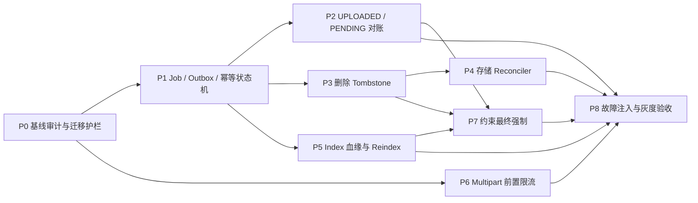

# 知识入库、存储与数据一致性改造计划

> 日期：2026-07-15
> 范围：知识文件上传、异步入库、对象删除、向量索引血缘、ORM 约束、Alembic 迁移与请求体限制
> 性质：当前实现评估与分阶段实施计划（时点快照）
> 证据基线：仓库提交 `099ec6863726`，以及本地工作区中 2026-07-15 的后端实现
> 状态：计划基线；实施进度应在 `work-items/` 跟踪，落地后的现状以代码和长期文档为准

## 1. 结论与目标

当前实现已经具备可运行的 Markdown RAG 主链路，但 PostgreSQL、Redis 和对象存储之间依赖“先写成功、异常时尽力补偿”。这能处理普通异常，不能覆盖进程退出、网络分区、重复投递和迁移脏数据，因此会出现以下不可证明状态：

- `knowledge_files.status=uploaded`，但没有可执行任务；
- `task_jobs.status=pending`，但 Redis 中没有消息；
- Redis 已收到消息，但 outbox 未确认，恢复后再次投递；
- 数据库仍有文件记录，但对象已经被删除，或文件记录已删而对象残留；
- 文件显示 `ready`，但无法说明其 chunk、embedding model 和当前配置是否匹配。

本计划的目标是建立四条可查询、可对账的事实链：

1. `File -> TaskJob -> TaskOutbox`：提交、投递和执行均有结构化关联，允许至少一次投递，依靠幂等消费收敛。
2. `File deletion -> ObjectDeletionTombstone -> ObjectStorage`：数据库先记录删除意图，对象删除可重试、可审计。
3. `File -> KnowledgeIndexRun -> DocumentChunk`：每批索引有完整血缘，reindex 通过新 generation 构建并原子切换。
4. 配置与数据库约束一致：上传上限只有明确的配置来源，非法状态、重复活动资源和孤儿引用由数据库拒绝。

### 1.1 本期范围

- ingestion job/outbox、条件状态流转和 `UPLOADED/PENDING` 对账；
- 对象删除 tombstone、删除 worker 和存储 reconciler；
- embedding/index 血缘、generation 切换和 reindex；
- 唯一约束、状态 `CHECK`、任务资源外键及安全 Alembic 路线；
- 在 multipart 解析前实施流式请求体限流，并与业务上传上限统一。

### 1.2 暂不纳入

- PDF、DOCX、OCR 等新解析器；
- chunk 算法本身的质量调优；
- HNSW 参数或多租户向量分区优化；
- S3 bucket versioning、KMS 和生命周期策略；
- 面向最终用户的知识库完整 CRUD。

## 2. 当前链路与代码依据

### 2.1 上传和入库存在三个提交边界

```text
HTTP multipart
  -> ObjectStorage.save_upload_stream()
  -> UoW #1: knowledge_files(UPLOADED) commit
  -> UoW #2: task_jobs(PENDING) commit
  -> Redis LPUSH(TaskIQ)
  -> worker: task PROCESSING, file PARSING -> CHUNKING -> READY
```

- `backend/application/knowledge/upload_workflow.py` 的 `submit()` 先提交 `File`，`_create_and_dispatch_ingestion()` 再提交 `TaskJob`，最后调用 `AbstractTaskDispatcher.enqueue_ingestion()`。
- `IngestionStateGuard` 只能捕获仍在 Python 调用栈内的异常；进程在任意两个边界之间退出时不会执行补偿。
- `backend/services/knowledge_service.py` 在数据库事务内执行对象上传；若 `UoW.__aexit__()` 的 commit 失败，异常发生在 service 的 `try` 之外，对象可能成为孤儿。
- `backend/infra/task_dispatcher.py` 直接向 Redis ListQueue `LPUSH`，没有与 PostgreSQL 提交绑定的持久化投递记录。

### 2.2 当前恢复逻辑没有覆盖待提交状态

- `backend/services/knowledge_ingestion_recovery_service.py` 只扫描 `PARSING/CHUNKING` 文件和 `PROCESSING` 任务。
- `backend/repositories/knowledge_repo.py::mark_stale_ingestion_files_failed()` 不处理 `UPLOADED`。
- `backend/repositories/task_repo.py::mark_stale_kb_ingestion_tasks_failed()` 不处理 `PENDING`。
- 文件和任务分别批量失败，没有通过结构化外键逐对校验，因此可能产生 `File=READY, Task=FAILED` 等分裂终态。

### 2.3 重复投递不是幂等的

- `backend/worker/tasks/knowledge_tasks.py` 收到消息后无条件把任务改为 `PROCESSING`。
- `backend/application/knowledge/ingestion_workflow.py` 只允许 `FileStatus.UPLOADED -> PARSING`。
- 已完成消息再次投递时，任务可能先从 `COMPLETED` 被改回 `PROCESSING`，随后因文件已是 `READY` 而失败，最终污染为 `FAILED`。
- `backend/repositories/task_repo.py` 的 `mark_processing/mark_completed/mark_failed` 都是无前置状态条件的更新。

### 2.4 删除顺序可能制造缺失对象或孤儿对象

- `backend/services/knowledge_service.py::remove_file()` 先调用 `storage.delete()`，忽略删除异常，再删除 chunks 和 file record。
- 对象删除成功、数据库 commit 失败时，数据库会指向不存在的对象；对象删除失败、数据库 commit 成功时，对象成为孤儿。
- `backend/services/object_storage.py::ObjectStorage` 只有 save/delete/download，没有 `head/list` 能力，无法做双向盘点。

### 2.5 索引缺少可判定的血缘

- `backend/models/orm/chunk.py` 只有 `chunking_version`，没有 embedding provider、model、dimensions、parser version 或 index generation。
- `DocumentChunk.embedding` 固定为 `Vector(768)`；`EmbeddingProfile.dimensions` 和 `RAG_EMBED_DIM` 没有在写入前与列维度做统一校验。
- `backend/services/vector_index_service.py::replace_file_chunks()` 删除旧 chunks 后写新 chunks；没有并存 generation，无法做到 reindex 期间持续服务旧索引。
- 当前上传去重只看 `(kb_id, content_sha256, READY)`；embedding 配置变化后，同一源文件仍会被判为已就绪。

### 2.6 ORM 约束不足

| 对象 | 当前情况 | 后果 |
| --- | --- | --- |
| `task_jobs` | `file_id/kb_id` 只在 JSONB `payload`，没有 FK | 无法可靠 join、级联处理或逐任务对账 |
| `knowledge_files` | `(kb_id, content_sha256)` 是非唯一索引 | 并发上传可生成多个活动文件 |
| `knowledge_bases` | 默认库只按中文名称查询，没有唯一约束 | 并发首次访问可创建多个默认库 |
| `document_chunks` | 没有 `(generation, chunk_index)` 唯一约束 | 重试批写可能产生重复 chunk |
| 状态字段 | 多数为 `String`，没有枚举值 `CHECK` | 非法状态可绕过 ORM 写入 |
| 数值字段 | `progress/file_size/chunk_index/token_count` 缺少范围约束 | 负数或超范围值可进入数据库 |

### 2.7 上传上限互相矛盾

- `backend/core/constants.py` 的全局 `MAX_PAYLOAD_SIZE_BYTES` 是 10 MiB。
- `configs/app/base.yaml` 和 `backend/config/ai_settings.py` 的 `KNOWLEDGE_MAX_UPLOAD_SIZE_MB` 是 20 MiB。
- `backend/middleware/payload_limit.py` 在判断 multipart 之前先检查 `Content-Length`，所以常规 10–20 MiB 上传会被全局 413 拒绝。
- 没有 `Content-Length` 的 multipart 被完全跳过，FastAPI/Starlette 可以先完成表单解析和临时文件缓冲，业务 service 才在读取 `UploadFile` 时执行 20 MiB 限制。
- `tests/unit/middleware/test_payload_limit.py` 当前明确断言 multipart 不由 middleware 限制，因而没有覆盖“解析前拒绝”的安全目标。

### 2.8 Alembic 基线需要先加固

- 当前单一 head 是 `91a39c0c190c`，`uv run alembic heads` 可通过。
- `scripts/qa/alembic_check.sh` 的 revision 正则不匹配当前 `revision: str = ...` 注解写法，孤儿检测实际上可能没有解析到 revision；多个 heads 目前也只告警、不失败。
- `2026_03_09_2128-678e5c0abf31_table_structure_fine_tuning.py` 创建新 `knowledge_files/document_chunks` 后直接删除旧 `files/file_chunks`，没有数据搬迁。若某环境仍从该 revision 之前升级，可能丢失知识文件与 chunk 数据。

> 数据安全警告：任何新迁移上线前，必须先确认生产 `alembic current`、创建数据库快照并验证恢复。若生产 revision 早于 `678e5c0abf31`，禁止直接执行 `alembic upgrade head`；应先制定带数据复制与行数/哈希核对的专项升级路径。

### 2.9 当前验证基线

本次扫描执行的知识链路 focused tests 为 `56 passed, 2 skipped`，覆盖 API、upload/ingestion workflow、storage、vector、recovery 和 worker 的现有行为；`make qa-alembic-check` 通过且数据库连通检查未启用。这证明当前 happy path 可运行，不证明进程崩溃、重复消息、跨存储提交或历史数据迁移的一致性。

## 3. 目标数据模型与不变量

### 3.1 复用 `task_jobs` 作为 ingestion job

第一阶段不新增重复的 `knowledge_ingestion_jobs`。现有 `task_jobs` 继续作为 API 可查询的 job 事实源，增加以下结构化字段：

| 字段 | 用途 |
| --- | --- |
| `knowledge_file_id` | nullable FK -> `knowledge_files.id`，`ON DELETE SET NULL`，保留历史任务 |
| `knowledge_base_id` | nullable FK -> `knowledge_bases.id`，`ON DELETE SET NULL` |
| `index_run_id` | nullable FK -> `knowledge_index_runs.id`，区分初次索引和 reindex 目标 |
| `attempt_count` | worker 成功 claim 时递增，限制自动重试 |
| `lease_expires_at` | 判断 `PROCESSING` 是否仍由活跃 worker 持有 |
| `heartbeat_at` | 长任务续租和运行可观测性 |

`payload` 暂时保留以兼容 TaskIQ 参数和旧任务，但不再作为资源关联的 source of truth。`TaskStatus` 增加 `CANCELED`，状态流转只允许：

```text
PENDING -> PROCESSING -> COMPLETED
   |           |
   +-----------+-> FAILED
   +-----------+-> CANCELED
```

- `COMPLETED/FAILED/CANCELED` 都是单调终态，任何普通 worker 调用都不能把它们改回 `PROCESSING`。
- repository 使用带 `expected_statuses` 的单条条件 `UPDATE ... RETURNING`，不再先读后无条件写。
- worker 收到重复消息时：终态直接 ack；有效 lease 下的 `PROCESSING` 直接 ack；`File=READY` 且目标 index run 已激活时，把仍非终态的对应 task 收敛为 `COMPLETED`。

### 3.2 新增 `task_outbox`

建议字段：

```text
id, task_id(FK), event_type, payload, status,
attempt_count, next_attempt_at, lease_owner, lease_expires_at,
published_at, last_error, created_at, updated_at
```

- `UNIQUE(task_id, event_type)` 保证一个业务事件只有一个稳定 outbox 记录；重复发送复用同一记录并增加 attempt。
- 状态为 `PENDING -> PUBLISHING -> PUBLISHED`，超过最大重试进入 `DEAD` 并告警。
- publisher 用 `FOR UPDATE SKIP LOCKED` 分批 claim，先提交 lease，再调用 `AbstractTaskDispatcher`，最后单独确认 `PUBLISHED`。
- “Redis 已写、确认前崩溃”会造成重复消息，这是预期的 at-least-once 语义，由幂等 worker 收敛。
- Web 请求在 `File + TaskJob + TaskOutbox` 同一 UoW commit 后可以做一次 best-effort 快速发布；失败不再把文件标为 `FAILED`，定时 relay 会补投。

### 3.3 文件与任务对账矩阵

reconciler 必须按结构化 FK 成对处理，而不是分别批量改状态：

| File | Task | Outbox/lease | 收敛动作 |
| --- | --- | --- | --- |
| `UPLOADED` | 缺失 | 缺失 | 在同一事务创建 `PENDING` task + outbox |
| `UPLOADED` | `PENDING` | 无待投递记录且超时 | 重置/创建 outbox 并重投 |
| `PARSING/CHUNKING` | `PROCESSING` | lease 有效 | 不处理 |
| `PARSING/CHUNKING` | `PROCESSING` | lease 过期、未超重试 | 清理未激活 run，task/file 重置并重投 |
| `PARSING/CHUNKING` | `PROCESSING` | lease 过期、已超重试 | 二者一起标为 `FAILED` |
| `READY` | `PENDING/PROCESSING` | 目标 run 已激活 | task 收敛为 `COMPLETED` |
| `FAILED` | `PENDING/PROCESSING` | 任意 | task 收敛为 `FAILED` |
| 文件已删除 | 非终态 | 任意 | task 收敛为 `CANCELED` |

### 3.4 新增对象删除 tombstone

`object_deletion_tombstones` 保存删除对象所需的完整快照，不依赖被删除后的 `File`：

```text
id, source_file_id, storage_backend, storage_bucket, storage_key,
object_uri, content_sha256, object_size, reason, status,
attempt_count, next_attempt_at, lease_expires_at, deleted_at,
last_error, created_at, updated_at
```

- `UNIQUE(storage_backend, storage_bucket, storage_key)` 使删除请求幂等。
- API 删除事务只做：权限检查、取消非终态任务、插入 tombstone、删除 chunks/file record；事务提交后才允许 worker 访问对象存储。
- 删除 worker 对“对象不存在”视为成功；暂时错误按指数退避重试，超过阈值进入 `DEAD` 并告警。
- 数据库 commit 失败时 tombstone 和 file 删除一起回滚，对象保持不动；对象删除失败时 tombstone 保留，因此不会失去重试依据。

### 3.5 扩展存储协议并建立 reconciler

`ObjectStorage` 增加 provider-neutral 能力：

- `head(stored_object) -> ObjectMetadata | None`：确认存在性、size、etag/sha256 和最后修改时间；
- `iter_objects(prefix, cursor, limit)`：分页枚举受 Dewflow 管理的 `v1/knowledge/` key；
- `delete()` 保持幂等语义。

reconciler 每次只处理有界批次，并区分三类差异：

1. tombstone 仍待处理：优先投递/重试删除；
2. 活跃 `knowledge_files` 指向缺失对象：不自动造数据，标记一致性错误、阻止入库并告警；
3. 存储对象没有 file/tombstone 引用：只有超过建议 24 小时 grace period 后才创建 tombstone，首期 dry-run，不直接删除。

Local backend 用限定 root 的递归扫描；S3 backend 用带 prefix 和 continuation token 的 `ListObjectsV2`。不能一次把全 bucket 载入内存，也不能扫描非 Dewflow prefix。

### 3.6 新增 `knowledge_index_runs`

每次初次索引或 reindex 都对应一个 generation：

```text
id, file_id(FK), source_sha256, status, is_active,
parser_name, parser_version, chunking_version, chunk_size, chunk_overlap,
embedding_profile, embedding_provider, embedding_model, embedding_dimensions,
index_spec_hash, lineage_complete, chunk_count,
started_at, finished_at, error_log, created_at, updated_at
```

- 状态为 `PENDING -> BUILDING -> READY`，失败为 `FAILED`，被新 generation 替换后为 `SUPERSEDED`。
- `UNIQUE(file_id) WHERE is_active` 保证每个文件最多一个活动 generation。
- `UNIQUE(file_id, source_sha256, index_spec_hash)` 保证同一源内容和索引规格只存在一个逻辑 run；失败重试复用该 run。
- `index_spec_hash` 由 parser/chunker/embedding 的非敏感、影响结果的字段稳定序列化后计算；不得包含 API key。
- `DocumentChunk` 增加 `index_run_id`，文件 chunk 强制非空，并增加 `UNIQUE(index_run_id, chunk_index)`。
- 现有 chunk 回填为 `lineage_complete=false` 的 `legacy/unknown` run，不伪造历史 embedding model；完成受控 reindex 后才获得完整血缘。

reindex 的执行顺序：

1. Web 侧校验权限，在单个 UoW 内创建/复用 `KnowledgeIndexRun + TaskJob + TaskOutbox`；仍通过 `AbstractTaskDispatcher` 边界投递。
2. Worker claim run 后在数据库事务外下载、解析和调用 embedding，避免持有长事务连接。
3. chunks 写入尚未激活的 run；大文件按 batch 事务写入，依赖唯一键实现重试幂等。
4. 最后用短事务核对 `chunk_count`，把旧 run 改为 `SUPERSEDED/is_active=false`，新 run 改为 `READY/is_active=true`。
5. 检索只读取 `is_active=true AND run.status=READY AND file.status=READY` 的 chunks；切换前始终由旧 generation 服务。
6. 旧 generation 在观察期后由 GC 分批删除；初期保留至少 24 小时以支持快速回切。

当前 `Vector(768)` 保持不变。worker 启动和创建 run 时必须验证解析出的 `EmbeddingProfile.dimensions == 768`；未来改变维度应走新的向量列/表和索引迁移，不能只改 YAML。

### 3.7 需要补齐的数据库约束

约束分为“先审计/回填”和“后强制”，不能在未知脏数据上直接创建：

| 表 | 目标约束 |
| --- | --- |
| `knowledge_bases` | 增加 `is_default`；personal default 使用 partial unique `(user_id) WHERE is_default AND workspace_id IS NULL` |
| `knowledge_files` | partial unique `(kb_id, content_sha256) WHERE content_sha256 IS NOT NULL AND status <> 'failed'` |
| `task_jobs` | `status` CHECK、`progress BETWEEN 0 AND 100`、attempt 非负、三个资源 FK |
| `task_outbox` | status CHECK、attempt 非负、`UNIQUE(task_id, event_type)` |
| `object_deletion_tombstones` | status/backend CHECK、size/attempt 非负、对象定位唯一 |
| `knowledge_index_runs` | status/dimensions/chunk_count CHECK、active/spec partial unique |
| `document_chunks` | source type 与对应 FK 一致、数值非负、文件 chunk 必须有 run、generation 内 index 唯一 |

并发上传不应依赖“先查后插”。repository 尝试插入后捕获唯一冲突，再读取 canonical active file；不得自动删除历史重复行。发现存量重复时输出报告，由人工确认 canonical row 和引用关系后再执行合并或失败重跑。

### 3.8 统一并前置上传大小限制

保留两个语义明确的配置值：

- `HTTP_MAX_JSON_BODY_SIZE_MB`：普通 JSON 请求体上限，建议维持 10 MiB；
- `KNOWLEDGE_MAX_UPLOAD_SIZE_MB`：知识文件净内容上限，当前 20 MiB，是业务层唯一来源。

`PayloadLimitMiddleware` 接收 settings 和 route-aware resolver：

- 已知 `Content-Length` 先拒绝；
- 对 JSON 和 multipart 都包装 ASGI `receive`，逐 chunk 计数，不拼接完整 body；
- 知识上传路径的 wire limit 由文件上限加固定 multipart envelope budget 派生，service 对文件净内容继续严格执行 20 MiB；
- 未知长度/chunked multipart 超限时，在 FastAPI 构造 `UploadFile` 并进入 endpoint 之前返回 413；
- 其他 multipart endpoint 使用各自明确策略，不能因知识上传放宽全局上限。

部署验收还要核对 Cloudflare/nginx/ALB 等上游 request body 限制；仓库当前没有发现对应配置，生产值必须不低于应用层 wire limit，且文档需记录 source of truth。

## 4. 工作流拆分与依赖关系



- `P0` 是所有数据库写入改造的阻塞前置。
- `P6` 只依赖配置基线，可与 `P1-P5` 并行。
- `P3` 可在 `P2` 开发期间并行，但要复用 `P1` 的 task 终态和 outbox primitive。
- `P5` 依赖幂等 job/outbox，不能继续基于裸 Redis 投递实现 reindex。
- `P7` 必须等待回填和 shadow validation；约束应证明数据正确，而不是替代数据清理。

## 5. 分阶段修改与验收

### 5.1 P0 — 基线审计与迁移护栏

修改内容：

- 修正 `scripts/qa/alembic_check.sh`，兼容带类型注解的 `revision/down_revision`，多个 head 直接失败，并把实际解析 revision 数量纳入输出。
- 增加可连接 PostgreSQL 的 migration CI：空库 `base -> head`、当前生产 revision 快照 `current -> head`，以及 ORM metadata drift 检查。
- 保存只读 preflight SQL，统计非法状态、重复默认库、重复 active content hash、payload 中非法 UUID、孤儿 task 和重复 chunk index。
- 确认生产 revision；先做 snapshot/PITR 恢复演练，再批准后续 migration。

验证与通过标准：

- `make qa-alembic-check` 对伪造 orphan 和双 head fixture 必须失败。
- `ALEMBIC_CHECK_DB=1 make qa-alembic-check` 在临时 PostgreSQL 上确认 current=head。
- 空库和脱敏快照升级后，关键表行数、每文件 chunk 数和抽样 hash 核对一致。
- preflight 报告中每类脏数据都有明确处置，不允许 migration 静默删除或任选 canonical row。

### 5.2 P1 — Job、Outbox 和幂等状态机

修改内容：

- Alembic expand migration：给 `task_jobs` 增加 nullable 资源 FK、lease/attempt 字段；创建 `task_outbox` 及 claim 索引。
- 更新 `backend/models/orm/task.py`、repository protocol、`TaskRepository`、`SQLAlchemyUnitOfWork`，新增 outbox ORM/repository。
- `TaskService` 改为显式条件状态流转；状态冲突返回 typed result，不把重复消费当系统错误。
- 拆分 `KnowledgeService.save_upload_file_for_ingestion()` 的对象写入和 DB 持久化职责：短事务做权限/KB 准备，对象上传不占用 DB 连接，随后一个事务写 `File + TaskJob + TaskOutbox`。
- `KnowledgeUploadWorkflow` 在 commit 后尝试快速 publish；失败保留 `PENDING`，不执行 `IngestionStateGuard` 式错误终态补偿。
- 新增 outbox relay service；由现有 scheduler 每分钟触发并复用 `AbstractTaskDispatcher`，不让 web import `backend.worker`。
- 记录 `outbox_pending_total`、`outbox_oldest_age_seconds`、publish attempt/error 和 duplicate-consume 指标。

验证与通过标准：

- 在“File 前、Task 前、outbox 前、commit 后、Redis 写前、Redis 写后确认前”逐点注入异常。
- DB commit 成功而 Redis 不可用时 API 仍返回持久化 job；Redis 恢复后 relay 最终执行。
- Redis 写成功但确认前崩溃时会重复投递，worker 只产生一个活动处理和一个终态。
- `COMPLETED/FAILED/CANCELED` 无法经 repository API 回到 `PROCESSING`。
- `make qa-boundaries` 证明 web/worker 依赖边界未破坏。

### 5.3 P2 — `UPLOADED/PENDING` 联合对账

修改内容：

- 用逐对查询替换 `KnowledgeIngestionRecoveryService` 的两个独立 bulk update；查询必须分页、带 age cutoff，并基于 task FK。
- worker claim 时写 lease；解析/embedding 的每个有界阶段续写 heartbeat，lease timeout 使用独立配置。
- 按 3.3 的矩阵实现 `reconcile_one()`，每条记录在短事务中 CAS 更新；批次之间不持有锁。
- `recover_stale_knowledge_ingestions` 保留 schedule，但返回每种 reconciliation action 的计数，而不是只有 failed count。
- 自动重试超过阈值后同时终结 file/task，并保留最后错误和 attempt count。

验证与通过标准：

- 对矩阵每一行建立 repository/service 测试，包含两个 reconciler 并发 claim 同一记录。
- `UPLOADED` 无 task、`PENDING` 无 outbox、过期 `PROCESSING` 均能在下一轮收敛。
- 活跃 lease 不被误杀；READY 文件关联的 task 不会被 timeout sweep 改成 FAILED。
- 一轮扫描有固定 `batch_size`，并对 `(status, updated_at)`、lease 和 outbox due time 有可用索引。

### 5.4 P3 — 删除 Tombstone 与异步删除

修改内容：

- 新增 `ObjectDeletionTombstone` ORM、repository/protocol/UoW 绑定和 Alembic expand migration。
- `KnowledgeService.remove_file()` 不再调用外部存储；在一个事务中取消 active task、插入 tombstone、删除 chunks 和 file record。
- 新增 storage deletion service 和 worker task；dispatcher/outbox 增加对象删除事件类型，删除仍为 at-least-once。
- 删除 API 继续返回 204，语义改为“数据库侧删除已接受”；对象物理删除状态通过内部指标/管理查询观察。
- 对 KB/user 级直接 cascade deletion 做专项测试；首期若没有应用删除入口，由 storage reconciler 捕获遗留对象，后续再决定是否增加 DB trigger 或显式父资源删除 workflow。

验证与通过标准：

- DB commit 失败时对象未被删除；对象存储失败时 file 对用户不可见且 tombstone 保持可重试。
- 同一删除消息执行两次、对象已不存在、S3 暂时 5xx 和 local permission error 都有确定结果。
- active ingestion 与删除并发时，删除获胜后 task 为 `CANCELED`，worker 不能重新写回 chunks/READY。
- tombstone backlog、oldest age、retry/dead count 均可观测。

### 5.5 P4 — 存储 Reconciler

修改内容：

- 扩展 `LocalObjectStorage/S3ObjectStorage` 的 `head/iter_objects`，并为 S3 pagination、prefix 隔离和 local root escape 增加测试。
- 新增有界 `StorageReconciliationService`，分别扫描 DB -> storage 和 storage -> DB。
- 首次上线强制 `dry_run=true`；输出 mismatch 明细到结构化日志/审计表，不执行孤儿删除。
- 至少观察一个完整保留周期并人工抽样后，才允许开启“为超 grace period 的 orphan 创建 tombstone”；reconciler 本身仍不直接删除对象。

验证与通过标准：

- 使用 Local 和 MinIO/S3-compatible integration tests 覆盖缺失、孤儿、分页、重复 key 和并发上传 grace period。
- dry-run 扫描对正常对象零误报；启用后只创建 tombstone，不触碰 prefix 外对象。
- 扫描可断点续跑，单批资源有上限，百万对象估算不会要求一次性加载完整清单。

### 5.6 P5 — Index 血缘、Generation 与 Reindex

修改内容：

- 新增 `KnowledgeIndexRun` ORM/repository/service 和 migration；给文件 chunks 增加 nullable `index_run_id`。
- migration 为每个已有 file 创建 `legacy/unknown` run，回填 chunk 关联；在核对完整后再强制文件 chunk 的 `index_run_id NOT NULL`。
- `VectorIndexService` 拆成 prepare/embed、batch stage 和 atomic activate；外部 embedding 不在 DB transaction 内执行。
- 检索 repository join active READY run，并同时过滤 `FileStatus.READY`；上线初期可用 shadow query 比较新旧结果数量和 top-k 重合率。
- 新增 `KB_REINDEX` task 和 `POST /files/{file_id}/reindex`（首期可限制为管理员/内部调用）；web 只通过 workflow + outbox 投递。
- 新增按 `index_spec_hash` 发现 stale files 的 dry-run 命令/管理查询，以及 superseded generation GC。

验证与通过标准：

- reindex BUILDING/FAILED 时旧 generation 持续可检索；只有完整写入并核对 chunk count 后才切换。
- 激活事务失败时仍只有旧 run active；激活成功后任何查询都不会混读两个 generation。
- 重复 reindex 消息不会产生重复 run/chunk；同 spec 已 READY 时直接返回现有结果。
- embedding 返回非 768 维时在写库前失败，并保留旧索引。
- 在固定检索样本上比较旧/新 generation 的 hit count、top-k overlap 和人工相关性，再批准批量 reindex。

### 5.7 P6 — Multipart 解析前限流

修改内容：

- 把 `MAX_PAYLOAD_SIZE_BYTES` 从硬编码常量迁入 settings，显式区分 JSON limit 和 knowledge file limit。
- `backend/main.py` 构造 `PayloadLimitMiddleware` 时注入配置和 path policy，不在 middleware 内直接 import 全局 settings singleton。
- middleware 用 counting `receive` wrapper 处理 multipart/chunked body，不再跳过 multipart，也不缓冲整个 JSON body。
- 统一 413 响应码和业务 error code；记录 route、declared/observed bytes 和 limit，禁止记录 body。
- 更新部署文档，列出应用与 edge/proxy 的有效上限和 multipart envelope 预算。

验证与通过标准：

- 已知/未知 `Content-Length`、chunked JSON、chunked multipart、等于上限和超过上限 1 byte 全覆盖。
- 超限 multipart 的 endpoint mock 未被调用，证明在 FastAPI 参数解析/业务 workflow 前拒绝。
- 20 MiB 净文件在合理 multipart envelope 内成功；20 MiB + 1 byte 净文件由 storage stream 再次拒绝。
- 慢速分块上传不导致 middleware 拼接大 bytes 对象；断开连接能正确向下游传播。

### 5.8 P7 — 回填完成后强制约束

迁移必须采用 expand -> backfill -> validate -> contract，而不是单个大 migration：

1. **Expand**：添加 nullable columns、新表、非唯一辅助索引和 `CHECK ... NOT VALID`；应用开始 dual-write。
2. **Backfill**：小批量回填 task FK、legacy index run、`is_default`；每批可重跑并记录进度。
3. **Validate**：运行差异查询；使用 `VALIDATE CONSTRAINT`；唯一索引用 `CREATE UNIQUE INDEX CONCURRENTLY`，Alembic 需使用 autocommit block。
4. **Contract**：切换读路径到结构化列，设置必要的 `NOT NULL`，最后停止把 payload 当资源关系来源。

Task FK 回填只接受合法 UUID 且目标行存在；非法/孤儿 payload 保持 null 并生成报告。默认库和 active content hash 的重复项必须人工确认，不允许 migration 自动删除文件、chunk、任务或对象。

验证与通过标准：

- 在接近生产体量的脱敏快照上记录每步耗时、锁等待和表膨胀；超出发布窗口则拆批或在线建索引。
- migration 中长表变更设置 `lock_timeout`/`statement_timeout`，失败可安全重跑。
- ORM metadata 与数据库无 drift，单 head，升级后所有 preflight 查询为零或落在批准的 legacy 例外表。
- downgrade 若会丢失新 generation/outbox/tombstone 信息，必须显式拒绝或只回滚应用读取；生产回退使用 forward fix 或快照恢复，不执行破坏性 downgrade。

### 5.9 P8 — 故障注入、灰度和最终验收

灰度顺序：

1. 部署 expand schema 和 dual-write，仍保留现有直接 dispatch；观察 FK/outbox 写入完整率。
2. 启用 outbox relay shadow/补投，再关闭“投递失败即 FAILED”的旧补偿逻辑。
3. 启用联合 reconciler，先只报告动作，确认后开放自动重投和过期失败。
4. 切换删除为 tombstone；storage reconciler 保持 dry-run 至少一个 grace period。
5. 回填 legacy index run，先对测试 KB reindex，再按小批次扩大。
6. 完成 constraint validation 后切换 structured columns 为唯一读源。
7. 最后启用 orphan tombstone creation 和 superseded index GC 等可删除能力。

每一步都需要独立 kill switch：outbox relay、state reconciler、storage deletion、orphan cleanup、reindex scheduler 和 index GC。关闭开关只能停止新动作，不能删除已有事实记录。

最终故障演练至少覆盖：PostgreSQL commit 失败、Redis 不可用/恢复、worker kill -9、消息重复、S3 5xx/404、reindex 中 embedding timeout、migration 中断后重跑，以及 chunked multipart 超限。

## 6. 预计代码改动面

| 层 | 现有/建议文件 | 职责 |
| --- | --- | --- |
| ORM | `models/orm/task.py`、`knowledge.py`、`chunk.py`，新增 lifecycle/index model 模块 | job FK、outbox、tombstone、index run 和约束 |
| Repository | `task_repo.py`、`knowledge_repo.py`，新增 outbox/storage lifecycle repository | CAS、claim、分页对账和 generation 查询 |
| Contract/UoW | `contracts/interfaces.py`、`repository_protocols.py`、`services/unit_of_work.py` | 绑定新 repository，保持显式 session/UoW 边界 |
| Web workflow | `application/knowledge/upload_workflow.py`，新增 reindex workflow | 原子写 File/Task/Outbox，commit 后投递 |
| Worker workflow | `application/knowledge/ingestion_workflow.py`、`worker/tasks/knowledge_tasks.py` | 幂等 claim、heartbeat、stage/activate、relay/reconcile task |
| Service | `knowledge_service.py`、`vector_index_service.py`、`object_storage.py`、recovery service | 拆外部 I/O 与事务、血缘、tombstone 和对账 |
| API/DI | `api/v1/endpoint/knowledge_api.py`、`api/deps/` | reindex 入口与依赖装配；endpoint 不直接访问 ORM/worker |
| Middleware/config | `middleware/payload_limit.py`、`main.py`、`config/ai_settings.py`、`configs/app/base.yaml` | route-aware 流式 body limit |
| Migration/QA | `alembic/versions/`、`scripts/qa/alembic_check.sh` | expand/backfill/validate/contract 与链路门禁 |
| Tests | `tests/unit/`、`tests/integration/`、`tests/smoke/` | 状态矩阵、故障注入、真实 PG/Redis/S3-compatible 验证 |

实际实现仍遵守 endpoint -> application/service -> repository -> ORM，以及 web -> `AbstractTaskDispatcher` -> worker 的边界。不要让 endpoint 直接写 outbox，也不要让 web import `backend.worker`。

## 7. 验证矩阵与命令

| 层级 | 必须证明的内容 |
| --- | --- |
| Unit | 状态 CAS、重复消费、reconciliation matrix、hash/spec 计算、size resolver、storage pagination |
| Component | upload/reindex/delete workflow 的 UoW 原子性和异常补偿语义 |
| Integration | PostgreSQL 约束/锁、Redis outage、TaskIQ 重复投递、Local + MinIO/S3-compatible 行为 |
| Migration | 空库和脱敏快照升级、可重跑 backfill、行数/hash、单 head 和 schema drift |
| Smoke | HTTP 202/204/413、最终 READY、删除最终无对象、reindex 无检索空窗 |
| Chaos | kill -9、网络恢复、publish-confirm crash、embedding/S3 timeout |

建议每个 PR 先运行 focused tests，合并前至少运行：

```bash
uv run pytest -q -p no:cacheprovider tests/unit/workflows/test_knowledge_upload_workflow.py
uv run pytest -q -p no:cacheprovider tests/unit/workflows/test_knowledge_rag_workflow.py
uv run pytest -q -p no:cacheprovider tests/unit/services/test_knowledge_ingestion_recovery_service.py
uv run pytest -q -p no:cacheprovider tests/unit/services/test_object_storage.py
uv run pytest -q -p no:cacheprovider tests/unit/services/test_vector_index_service.py
uv run pytest -q -p no:cacheprovider tests/unit/middleware/test_payload_limit.py
make qa-alembic-check
ALEMBIC_CHECK_DB=1 make qa-alembic-check
make qa-boundaries
make qa-layer-deps
make qa-lint
make qa-typecheck
make flow-ci
```

本计划文档自身使用 `make qa-docs` 验证。

## 8. 完成定义

以下不变量全部成立才算完成：

- 每个非终态知识任务都有结构化 `knowledge_file_id`；它要么有 due outbox，要么有未过期 worker lease。
- 任意消息重复执行不会把终态倒退，也不会产生第二个 active file/index run 或重复 chunk index。
- `FileStatus.READY` 的文件恰有一个 active `KnowledgeIndexRun(READY)`，其 `source_sha256` 与文件一致，chunk count 可核对。
- reindex 构建失败或 worker 崩溃不会影响旧 active generation 的检索。
- 用户删除文件后数据库立即不可见；对象最终删除，失败则一定有非终态/DEAD tombstone 可追踪。
- 超过 grace period 的 DB/object mismatch 为零，或均有已确认的告警/豁免记录。
- 所有状态、范围、唯一性和资源引用约束在数据库层生效，preflight 脏数据查询为零。
- 超限 multipart 无论有无 `Content-Length`，都在 endpoint/workflow 前返回 413；业务净文件上限与配置一致。
- migration 在备份恢复演练和脱敏快照上通过，且不存在未评估的破坏性 downgrade。

## 9. 建议默认参数与待确认点

为避免实现阶段停在参数讨论，首版建议使用以下保守默认值，再根据生产指标调整：

| 项目 | 首版建议 |
| --- | --- |
| outbox relay interval | 60 秒，Web commit 后另做一次 best-effort 快速 publish |
| worker heartbeat / lease | 每 60 秒 heartbeat，lease 5 分钟并持续续租 |
| ingestion max attempts | 3 次，之后 file/task 同时 FAILED |
| object deletion max attempts | 10 次指数退避，之后 DEAD + 告警 |
| orphan grace period | 24 小时，且先完整 dry-run 一个周期 |
| superseded index retention | 24 小时后 GC |
| tombstone retention | 成功记录保留 30 天，DEAD 记录人工关闭前不清理 |
| reindex exposure | 首期仅内部/管理员入口，验证稳定后再决定用户自助 |

仍需在首个实施 PR 前确认两项生产事实：生产数据库当前 revision，以及实际 edge/proxy 请求体上限。它们会影响迁移路径和上传验收，但不改变上述模块依赖关系。
