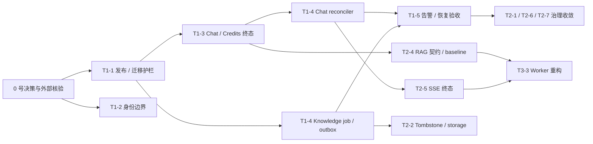

# Dewflow 后端综合升级路线

> 日期：2026-07-17
> 范围：Chat / RAG / Worker、知识入库、数据一致性、身份与权限、测试与 CI、部署韧性、可观测性、安全、恢复和产品领域边界；含前端 Chat 重试接入（作为 T1-3 验收闭环的组成部分）
> 性质：对五份 2026-07-15 / 2026-07-17 评估的跨文档归并与分档路线；记录决策门、依赖、最低验收和停止边界，不代表修改已经完成
> 证据基线：分支 `chore/deps-batch-patch`；两份 2026-07-15 计划基于提交 `099ec68`，三份 2026-07-17 评估及前端 retry 补充复核基于提交 `af4f855`；复核收尾时当前 `HEAD=8e5971b`，相关 T1-3 证据文件相对 `af4f855` 无代码差异
> 状态：评估基线；尚未实施代码、迁移、配置或外部控制面改动，后续进度应在 `work-items/` 跟踪

## 1. 综合结论

Dewflow 当前的 Web / Worker 边界、FastAPI 分层、RAG 模块化和单机部署入口总体可保留，不需要推倒重构。最优先的问题不是 Kubernetes、文件大小或抽象层次，而是跨 PostgreSQL、Redis、TaskIQ、Credits、对象存储和 SSE 的业务终态没有统一、持久、可恢复的协议。

五份评估归并后，主线可以概括为：

1. 先让发布、迁移、认证和备份边界可信，避免带着不可验证的护栏修改核心数据模型。
2. 再让 Chat 请求、消息和 Credits 只有一个持久终态，Redis 不再承担业务事实源。
3. 随后让 Chat 与知识入库的已接受任务不静默消失，允许至少一次执行，但只允许当前 attempt 提交一次终态。
4. 用真实告警、故障注入和恢复演练证明上述协议，而不是只证明正常路径可运行。
5. 在行为契约稳定后，再推进 RAG 质量、Token / Secret 治理、Workspace 产品化、索引重构和基础设施扩展。

当前系统可以继续用于受控内测和低流量验证，但前提是启用能力具有明确的 fail-closed 配置、失败可见、数据可恢复。若 Chat、知识入库和 Credits 承载正式业务，则本报告第一档中与已启用能力相关的事项均应视为上线阻断项。

## 2. 证据边界与判定口径

本报告使用以下口径，后续工作不得把建议误写成已实现能力：

| 标记 | 含义 | 使用方式 |
| --- | --- | --- |
| 已确认 | 当前代码、配置、迁移或仓库文件直接支持 | 可以进入修复设计，但仍需测试证明运行结果 |
| 需验证 | 多段静态路径构成高风险推断，尚未动态复现 | 第一动作是复现或证伪，不预设漏洞成立 |
| 外部实证 | GitHub、AWS、Cloudflare、SNS 等控制面状态 | 必须重新在线核验，不能沿用 2026-07-17 快照作为永久事实 |
| 设计 | 推荐的目标模型或产品选择 | 不计入当前能力，实施前需通过对应决策门 |

条目中的“来源”指针使用别名 D1–D5，依次对应第 12.1 节的五份源评估：D1=Chat / RAG / Worker 主链路、D2=知识入库与数据一致性、D3=部署 / 韧性 / 可观测性 / 安全、D4=身份治理与测试 / CI、D5=产品领域与业务地图。

本次复核使用 `af4f855` 作为静态证据基线；复核收尾时当前 `HEAD=8e5971b`，`af4f855` 是其祖先，T1-3 引用的后端 Chat 与前端 retry 证据文件没有代码差异。相关后端、部署与 CI 文件相对 `099ec68` 亦无代码差异，五份源文档仍可作为当前静态基线。生产数据分布、GitHub Actions 最新结果、RDS / S3 配置、CloudWatch 告警和真实故障恢复仍未实证。

工作量只使用相对等级，不映射为虚构工期：

| 等级 | 定义 |
| --- | --- |
| S | 单一边界内的配置、校验、脚本或小型缺陷修复 |
| M | 跨多个模块，或包含迁移、契约测试和灰度切换 |
| L | 跨 Web / Worker / DB / Redis 等边界，需要多 PR、兼容期和故障验收 |

## 3. 0 号决策门：编码前先冻结的事实

0 号门不属于“未来工作”。这些决策和核验应立即完成，但不等于立即执行 Workspace 全量迁移或基础设施重建。

| ID | 决策或核验 | 推荐默认 | 影响范围 |
| --- | --- | --- | --- |
| G0-1 | 当前交付阶段是受控内测还是正式生产 | 未通过第一档前只按受控内测描述 | 所有上线门槛 |
| G0-2 | personal scope 是否长期收敛为 personal Workspace | 若产品包含团队协作，采用 Workspace-first；本期只冻结语义和预留字段 | 新 request/job、授权和后续迁移 |
| G0-3 | Credits 主体是 User 还是 Workspace，旧 Token 配额是否退出 | 短期以 User Credits 为单一生效账本，旧配额进入退出计划 | Chat 结算、UI 和 Workspace 预算 |
| G0-4 | Google、SMS、Langfuse 等能力在生产是否启用 | 未完成安全闭环的能力默认关闭 | 身份和内容隐私门槛 |
| G0-5 | `web_only` 无证据时的产品语义 | 明确拒答或失败；若允许自由回答则改名 `web_preferred` | RAG 契约和评测 |
| G0-6 | HTTP 断连是否取消 Worker | 默认不取消；结果继续持久化并从 DB 恢复 | Chat、SSE 和 Credits |
| G0-7 | GitHub、RDS、S3、CloudWatch、Cloudflare 当前状态 | 重新只读核验并保存日期、负责人和证据 | CI、备份、告警和恢复验收 |

0 号门的完成标准：

- 每项决策有 owner、日期、推荐值和偏离推荐时的风险说明。
- 完成生产 revision、脏数据、悬挂任务、Redis eviction 和双账本存量盘点。
- 未冻结租户和计费语义前，不做大规模 `NOT NULL`、历史回填或 Workspace 数据迁移。
- 外部控制面核验结果带时间戳；过期后重新验证，不写成永久仓库事实。

## 4. 三档路线总览

| ID | 工作流 | 档位 | 工作量 | 主要依赖 |
| --- | --- | --- | --- | --- |
| T1-1 | CI、迁移与发布护栏可信化 | 第一档 | S–M | G0-1、G0-7 |
| T1-2 | OAuth、Workspace 软删和认证入口高风险边界 | 第一档 | M | G0-4 |
| T1-3 | Chat generation request、消息与 Credits 终态一致性（含显式重试与前端接入） | 第一档 | L | G0-2、G0-3、T1-1 |
| T1-4 | Redis 职责、Chat 恢复和 Knowledge durable ingestion | 第一档 | L | T1-3（Chat）；T1-1（Knowledge） |
| T1-5 | 最低告警闭环与恢复实证 | 第一档 | M | G0-7；字段契约可与 T1-3 并行，验收依赖 T1-3、T1-4 |
| T1-6 | 观测原文与 unsafe output 的安全默认值 | 第一档 | S–M | G0-4 |
| T2-1 | 结构化观测、降级信号和内容治理完整版 | 第二档 | M | T1-3、T1-5 |
| T2-2 | Knowledge 删除 tombstone 与存储对账 | 第二档 | M–L | T1-4 |
| T2-3 | 上传上限统一与 multipart 前置限流 | 第二档 | S–M | T1-1 |
| T2-4 | RAG 语义、已确认缺陷和真实评测基线 | 第二档 | M | T1-3 |
| T2-5 | SSE 终态契约与断连后 DB 恢复 | 第二档 | M | T1-3、T1-4 |
| T2-6 | CSP、Token 生命周期与浏览器凭据治理 | 第二档 | L | T1-2 |
| T2-7 | Secret 最小权限、轮换和恢复 runbook | 第二档 | M | G0-7 |
| T2-8 | 权限语义与真实 PostgreSQL 治理测试 | 第二档 | M | G0-2、T1-2 |
| T2-9 | Credits 双账本收敛和小型账务缺陷 | 第二档 | M | G0-3、T1-3 |
| T2-10 | Embedding 维度校验与最小索引规格记录 | 第二档 | S–M | T1-4 |
| T3-1 | Workspace-first 迁移与协作产品化 | 第三档 | L | G0-2、第一档；repo analysis 计费 checkpoint 依赖 G0-3、T2-9 |
| T3-2 | 完整索引血缘、generation 和 reindex | 第三档 | L | T2-2、T2-10 |
| T3-3 | Worker generation 结构重构 | 第三档 | L | T2-4、T2-5 |
| T3-4 | Kubernetes、Broker 替换和多副本生产化 | 第三档 | L | 第一档、第二档核心项 |
| T3-5 | 完整供应链、自动化 DR 和高级质量门 | 第三档 | L | 业务规模、SLA 或合规要求 |

## 5. 第一档：必须优先处理

### 5.1 T1-1 — CI、迁移与发布护栏可信化

**问题。** 已确认 `smoke-ci.yml` 的 PR paths 过滤不含普通业务源码，而 2026-07-17 快照中 Ruleset 把 `Docker smoke` 设为 required check（Ruleset 状态属外部实证，按 G0-7 复核），普通业务 PR 可能永久等待一个不会创建的 check；已确认后端 coverage floor 声明存在但 Make / CI 未启用 `--cov`；Security CI 持续失败为 2026-07-17 快照事实。已确认 Alembic 检查脚本的 revision 正则不兼容类型注解写法、历史迁移 `678e5c0abf31` 无数据搬迁；生产 revision 与备份能力尚未形成统一放行门。

**来源。** D4 §5.2–5.4、§7（R3–R5）；D2 §2.8、§5.1。

**最低必须做到：**

- 重新核验 GitHub Ruleset；任意受保护 PR 都能创建全部 required checks，不再等待不存在的 job。
- 后端 coverage 实际运行并生成报告；若真实基线低于 75%，使用显式过渡 floor，不保留虚假门槛。
- Security CI 恢复绿色，或为每个例外记录负责人、原因和到期日，再决定哪些 job required。
- guard-branch-protection 改读 Rulesets API 并保留 classic 兼容分支，消除“Ruleset 生效却报告无保护”的持续误报。
- 修正 Alembic 单 head / orphan 检查，确认 production `alembic current`，保存迁移前只读审计和备份 preflight。
- 所有新增约束使用 expand -> backfill -> validate -> contract，不让 migration 自动删除或任选业务数据。

**做到即可停止：**普通业务 PR、故意触发 coverage 回归的 PR、伪造双 head / orphan migration 均得到预期阻断；目标迁移在临时 PostgreSQL 和脱敏快照上可重复执行。

**当前不需要：**为了追求数字继续堆 mock 单测、一次性把所有 Security CI job 设为 required、自动 rollback 平台或完整 chaos 工程。

### 5.2 T1-2 — 身份与授权高风险边界

**问题。** 已确认 Google OAuth 缺少服务端会话绑定（无 `state` / PKCE），redirect allowlist 为空时 fail-open；需验证 Workspace 软删除后残留角色是否实际越权（角色查询不校验 Workspace 活跃状态属已确认，越权后果待真实数据库复现）；已确认 SMS 非 mock 路径未完成、公开注册允许产生没有可用认证方式的用户、email 自动关联前没有显式要求 verified email。

**来源。** D4 §3.2–3.3、§7（R1–R2）；D5 §5.6。

**最低必须做到：**

- OAuth 使用一次性、带 TTL、绑定 redirect / 浏览器会话的服务端 `state`，采用 PKCE；生产 allowlist 为空时启动失败。
- Google email 关联要求 `email_verified=true`，并覆盖伪造 redirect、重放 callback 和 state 不匹配测试。
- 使用真实 PostgreSQL 复现或证伪 Workspace 软删残留；若成立，在有效权限入口统一校验 Workspace 活跃状态。
- SMS provider 未接通前生产配置 fail-closed；公开注册必须产生至少一种可用认证方式。

**做到即可停止：**删除 Workspace 后，workspace、KB、文件、Chat 和 audit 入口均稳定返回 403/404；所有启用的认证方式均有攻击路径测试和启动期配置校验。

**当前不需要：**SSO、多 IdP、多设备会话管理或完整前端 Workspace 管理面。Cookie 化、refresh 和撤销体系进入 T2-6。

### 5.3 T1-3 — Chat 终态与 Credits 一致性

**问题。** 以下均属已确认：Redis 幂等键按 `(user_id, client_request_id)` 隔离，DB 却对 `client_request_id` 建全局唯一索引；Credits 扣费失败时持久化函数静默返回，调用方仍可能写 completed marker；Redis marker 失败又可能把已提交成功和已扣费消息逆转为失败。当前没有 durable request、attempt 或 lease 作为业务事实源。

前端重试实现已确认存在不安全分支，但后果必须按失败发生点分级：

- **已落库的 Worker 失败。** Worker 已删除 Redis 锁、失败消息行仍保留 `client_request_id`；本地缓存命中后复用该 ID，会撞全局唯一索引。IntegrityError 未被业务异常捕获，新占的 Redis 锁不会主动释放，在 300 秒 TTL 内再次重试会得到误导性“正在处理中”提示。该路径及后果属已确认。
- **服务端已接受请求，但前端丢失原身份。** 重试缓存过期或失败消息从历史详情加载时，前端生成新的 `client_request_id`，后端会把它当成第二个逻辑请求并重复插入 user 消息；若原请求已经完成 settlement、仅因后续 marker 故障被逆转成失败，新请求成功还可能造成第二次结算。重复逻辑请求与消息属已确认，是否重复扣费取决于原请求是否已经结算，不能写成所有失败都会发生的确定事实。
- **服务端可能尚未接受请求。** 默认知识库解析失败等本地 preflight 错误，以及无 reader、HTTP 异常或收到 SSE meta 前断流，也会进入同一重试缓存；此时既可能没有任何服务端 request，也可能是服务端已接受但身份响应丢失。静态代码不能判断应复用还是生成新 ID，必须先解析服务端状态。

因此，当前问题不是“重试必然只有一种失败结果”，而是前端无法区分未接受、执行中、已失败可重试和身份未知状态，无法保证安全重试。

**来源。** D1 §3、§5（WS1）；故障用例矩阵直接复用 D1 §5.3。前端缓存、回退和 preflight / transport 错误入口为 2026-07-17 基于 `af4f855` 的复核补充，代码位置见 §12.2；某次异常是否已被服务端接受、原请求是否完成 settlement 属运行时状态，必须通过持久 request 解析。

**建议范围：**

- 新增 `chat_generation_requests` 或等价持久 request，使用 `generation_request_id` 表示跨 attempt 的稳定业务身份，最小包含 owner / tenant、状态、attempt、lease、heartbeat、terminal outcome 和稳定 `error_code`；现有 `request_id` / `X-Request-ID` 继续只表示单次 HTTP 链路身份，日志和 API 不混用两者。
- 请求唯一性定义为 `(user_id, client_request_id)`；迁移前审计存量，消息兼容字段可保留但不再承担 request 状态机。
- `persist_success` 返回显式 outcome；消息、Credits settlement 和 request terminal 在同一 DB UoW 中提交。
- Redis 只承担快速并发抑制、通知和缓存；Redis 写失败不得逆转已经提交的 DB / Credits 结果。
- 只有当前 attempt / lease 可以提交终态，晚到 Worker 使用 CAS 失败退出。
- 增加按 `(user_id, client_request_id)` 解析持久 request 状态的查询或等价协议，区分“服务端未接受”和“已接受但响应身份丢失”；身份未知时不得直接生成新 ID 重发。若最终采用客户端预生成 `generation_request_id`，也必须由服务端按当前 actor 校验并返回同一持久状态。
- 增加显式 retry command（形如 `POST /chat/requests/{generation_request_id}/retry`，携带 `expected_attempt`）；只允许当前 actor 有权访问且处于 terminal failed、`retryable=true` 的 request 进入下一 attempt，RUNNING、CAS 冲突和不可重试错误均返回稳定业务错误而非 500。
- retry / status 路径遵守 endpoint -> service / application workflow -> repository 边界；repository 查询同时限定当前用户、有效 Workspace / tenant 和 session 归属，不允许仅凭路径 ID 读取或重试。feature flag 不承担授权，跨用户、跨 Workspace 和软删 Workspace 使用 403 / 404 验收。
- SSE meta 至少携带 `generation_request_id`、`attempt`；error 事件和 session detail 还携带 `retryable`、稳定 `error_code`。新 retry 路径缺少这些字段时必须 fail-closed，不能从本地缓存猜测服务端状态。
- 前端 `useChatStream` 改为使用服务端 generation request 身份发起显式 retry，删除“本地 Map 复用 ID”与“缓存缺失回退新 ID 重发”两条业务重试路径；重试缓存降级为只存 query 文本等 UI 信息。灰度 flag 由后端下发，使用稳定 `kebab-case` key、缺失时回退 `false`，并记录 owner、scope、切换和删除 checkpoint；前端只通过 `useFeatureFlag()` / `FeatureGate` 消费。

**最低必须做到：**

- 扣费失败不能返回业务 success；同一逻辑 generation request 最多产生一个最终消息和一次结算。
- 跨用户同 `client_request_id`、失败重试和 Redis SET / DELETE 故障都有确定结果；按 `generation_request_id` 的 status / retry 请求必须校验当前用户、有效 tenant 和 session 归属。
- 前端能区分服务端未接受、仍在执行、terminal failed 可重试和身份未知；身份未知时先解析持久 request，解析失败则禁用 retry，不得盲目生成新 ID。
- 兼容窗口内旧前端复用同 ID 重试 fail-closed（返回已有 generation request 状态或稳定业务错误，不产生第二条消息、第二次结算或 500）。
- 对仍在执行的 generation request 发起重试得到明确“仍在生成”反馈（对应 G0-6 断连不取消 Worker）。

**做到即可停止：**并发同 ID、跨用户 / Workspace 访问、旧 attempt 晚到、重复 settlement、Redis 故障、本地 preflight 失败、meta 前断流、身份解析和失败重试矩阵进入 CI；DB 可以解释每个 generation request 的当前和最终状态；从历史详情加载的失败消息在页面刷新后仍可发起重试。

**交付拆分。** 建议按三个 PR 推进：① additive 迁移 + repository + CAS / 授权合同测试（依赖 T1-1 迁移护栏先行）；② Web / Worker 切换 attempt / lease、原子终态与 `(user_id, client_request_id)` 状态解析，同 ID 冲突转为稳定业务错误；③ 显式 retry API + 前端 `useChatStream` 接入 + 端到端故障矩阵。显式 retry 与前端接入是本项验收闭环的组成部分；repository / CAS 矩阵可以在 API 前完成，但没有显式命令和前端接入时，端到端失败重试矩阵不能完成。

T1-3 标记为 `validated` 前，至少要求 flag-on 的显式 retry 端到端矩阵通过，同时 flag-off / 缺失 flag 的旧前端路径已 fail-closed；feature flag 全量流量切换可以作为运营 checkpoint 拖尾，但在完成前不能对外宣称所有用户均已获得安全重试。前端接入、灰度观察和 flag 删除应在 `work-items/` 中分别跟踪，避免后端 validated 时前端切换被遗漏。

建表时应按 T1-4 的 `PREPARED + reconciler` 预留状态与字段（heartbeat、lease 过期、有界恢复所需 due time），新代码路径的日志按 T1-5 的结构化字段契约（`event`、`error_code`、`generation_request_id`、`http_request_id`、`attempt` 等）一次到位。

**当前不需要：**外部 LLM exactly-once、第一阶段删除所有兼容字段、Redis Streams replay。SSE 首期只增加向后兼容的 additive 字段：meta 使用 `generation_request_id` / `attempt`，error 与 session detail 增加 `retryable` / `error_code`；旧 schema 可以把这些字段声明为 optional，但新 retry 路径缺失字段时必须按不可重试处理。完整 versioned 终态事件契约仍归 T2-5，不随本项提前。LLM 前 Credits reservation 可在产品要求严格成本控制时加入；最低阶段必须明确接受或拒绝“生成完成但最终余额不足”的成本政策。

### 5.4 T1-4 — Redis 职责与持久任务恢复

这一工作流共享交付语义和测试方法，但不应过早建设一个万能任务状态机框架。Chat 与 Knowledge 保留各自的领域状态，通过稳定 ID、attempt / lease、CAS、reconciler、指标和 `AbstractTaskDispatcher` 对齐。落入 `work-items/` 时建议拆为 Redis 职责隔离、Chat 恢复、Knowledge durable ingestion 三个 checkpoint 分别跟踪验收，不作为单一交付物。

**实施状态（2026-07-17）：`validated`。** Chat recovery、Knowledge durable ingestion、Redis 职责隔离三个实现 checkpoint 均已完成；一次性环境中的 DB commit / enqueue、全 Redis restart、重复 delivery、Worker `SIGKILL`、晚到 attempt、派发预算耗尽、Credits 单次结算与 chunk 单次写入矩阵为 `6 passed`。结构化信号与人工恢复入口已经冻结在 [T1-4 work item 的 WS7 交接合同](../../work-items/active/durable-task-recovery/task-plan.md#ws7--t1-5-可观测性交接合同)。这只关闭 T1-4，不表示 T1-5 的 CloudWatch / SNS、生产恢复和 RPO / RTO 实证已经完成。

**来源。** D3 §4、§9.1（P0.1 / P0.2）；D1 §6（WS2）；D2 §3.1–3.3、§5.2–5.3（P1 / P2）。Redis 配置与 ListQueueBroker 破坏性 pop 属已确认；丢失 / 淘汰是否已在生产发生属需验证，由 G0-7 的 eviction 与悬挂任务盘点回答。

**Redis 最低基线：**

- 可淘汰缓存与 broker / result 至少分离到不同 Redis 容器或实例，broker 使用 `noeviction`、AOF、持久卷和明确 result TTL。
- 明确这只能降低重启与淘汰风险，不能修复 ListQueueBroker 已破坏性 pop 的 in-flight 消息。
- DB durable request / job 和 reconciler 必须能在 Redis 全量重启后重建或明确终结非终态业务请求。

**Chat 路径：**第一阶段使用 `PREPARED + reconciler` 可以接受；Web 先提交 request，dispatch 后 CAS 记录 task，reconciler 对未投递、未启动和 lease 过期状态做有界恢复。若 SLA 要求严格关闭 DB commit 后、Redis enqueue 前的窗口，再增加 transactional outbox。

**Knowledge 路径：**`File + TaskJob + TaskOutbox` 应在同一事务提交，outbox relay 执行至少一次投递，Worker 条件 claim 并幂等消费；`UPLOADED / PENDING / PROCESSING` 使用结构化关联联合对账。除非明确让 `TaskJob` 自身完整承担 publish 状态、claim lease、attempt 和 due time，否则 Knowledge outbox 不是可选增强。

**最低必须做到：**终态单调不可回退；已接受请求不会因 Redis 重启永久消失；所有非终态有有界恢复或明确失败路径；在 fencing 完成前不启用盲目自动 retry。

**做到即可停止：**DB commit、Redis enqueue、Worker start / finish 各边界的进程退出测试通过；重复消息只产生一个业务终态和一次 Credits / chunk 写入；SIGKILL 后任务可恢复或进入可告警、可人工 replay 的失败态。

**当前不需要：**更换 RabbitMQ、引入 Redis Streams、建设通用 DLQ 平台、KEDA 或跨业务统一 Workflow 基类。

### 5.5 T1-5 — 最低告警与恢复实证

**来源。** D3 §6.2–6.3、§8、§9.1（P0.3 / P0.4）。CloudWatch filter 与日志字段不匹配属已确认；RDS / S3 / SNS 实际状态属外部实证。结构化字段契约可与 T1-3 并行定义，只有告警与恢复验收依赖 T1-3、T1-4 的恢复原语落地。

T1-4 已提供可消费的 recovery / heartbeat / outbox 事件、批次 trace 计数、持久诊断字段和 CAS replay 入口；T1-5 应直接复用其[信号交接合同](../../work-items/active/durable-task-recovery/task-plan.md#ws7--t1-5-可观测性交接合同)，不再从自由文本日志反推任务状态。

**最低必须做到：**

- 统一 `event`、`error_code`、`task_name`、`job_id`、`attempt`、`duration_ms` 等 JSON 顶层字段，修正与日志不匹配的 CloudWatch filters。
- 首批覆盖 API 5xx / 延迟、queue depth / oldest age、Worker / Scheduler heartbeat、task failure、Redis eviction / restart、RDS backup failure 和日志 dead-man。
- 至少一次受控故障真实完成“日志 -> metric -> Alarm -> SNS -> 人员确认 -> 恢复”，而不是只验证脚本退出码。
- 正式生产前实证 RDS snapshot / PITR 恢复、Redis / Worker 中断后的 job reconciliation，以及已启用知识能力对应的 S3 version / 对象恢复。

**做到即可停止：**受控内测具有人工恢复 runbook 和明确失败状态；正式生产具有与已启用能力匹配的 RPO / RTO 实测记录。单 EC2 / Tunnel 丢失恢复可先人工，但步骤、secret 轮换和权限必须可执行。

**当前不需要：**全量 SLO 平台、自动跨 AZ 接管、完整 chaos suite 或自动化灾备编排。

### 5.6 T1-6 — 内容与观测安全默认值

**问题。** 已确认当前代码会把完整 generation payload / output 交给 Langfuse recorder，guardrail 触发时会把原始 unsafe output 写入普通 message metadata。

**来源。** D1 §8（WS4）；D3 §7.4。

因此：

- 无论 Langfuse 是否启用，原始 unsafe output 都不应进入普通业务 metadata；默认只保留 hash、category、规则和脱敏摘要。
- 如果生产启用 Langfuse 或其他第三方 tracing，必须默认 `capture_content=false`；需要原文时按环境显式 opt-in，并配置脱敏、采样、访问权限和 retention。
- provider reasoning / `<think>` 内容不得进入 SSE、普通消息持久化或常规 telemetry。

**做到即可停止：**synthetic secret / PII fixtures 证明默认配置下无 query、history、output、reasoning 或 unsafe 原文外发和普通持久化。

**当前不需要：**逐句 LLM 安全 judge、完整 badcase 加密平台或所有流式 chunk 的高级分类器；这些属于第二档内容治理。

## 6. 第二档：收益最高，建议完成

第二档不是“低优先级”。它应在第一档的事实源和恢复原语稳定后连续推进，目标是用较低边际成本提升核心体验、排障能力和长期开发效率。

| ID | 最低范围 | 做到即可停止 | 当前不需要 | 主要来源 |
| --- | --- | --- | --- | --- |
| T2-1 观测与内容治理 | 补齐 typed degradation、稳定业务指标、关键 dashboard；输入、Web chunk、输出和 telemetry 有统一 sanitizer / retention | normal / empty / degraded / failed 可在 API、SSE、日志和 trace 区分；首批 dashboard 可定位主链路故障 | 全量跨进程 trace 覆盖率目标、APM 平台化、昂贵在线安全 judge | D1 §8；D3 §5–6、§7.4 |
| T2-2 Knowledge 删除与存储一致性 | DB 事务先记录删除意图和 tombstone，对象删除异步幂等重试；存储协议增加 `head`，reconciler 首期只 dry-run | DB commit 失败不删对象；存储失败保留可重试 tombstone；孤儿/缺失报告零误删 | 自动孤儿清理、百万对象平台化扫描、立即引入 KMS / 生命周期全套 | D2 §3.4–3.5、§5.4–5.5 |
| T2-3 上传限流 | JSON 与 knowledge file limit 使用同一配置事实源；counting receive wrapper 在 multipart 解析前拒绝超限 body | 20 MiB 合法文件成功，超限 1 byte 在 endpoint 前稳定 413；上游代理上限已核对 | 分片上传、断点续传、S3 浏览器直传 | D2 §2.7、§3.8、§5.7 |
| T2-4 RAG 语义与评测 | 修复最近历史、FAILED history、prompt-used refs；引入 `RetrievalOutcome`；建立版本化真实 dataset 和首次 baseline | 四种 mode 的 normal / empty / degraded / failed 契约可重复验证；baseline 至少稳定复跑一次后批准 regression budget | 在线逐句 faithfulness judge、第一版就设武断阈值、把外部 LLM judge 设为每次 merge gate | D1 §9 |
| T2-5 SSE 终态 | versioned started / step / chunk / terminal 事件；terminal 仅在 DB 提交后发布；断连后从 request status 恢复 | error 后 `[DONE]` 不会变 success；断连重进可读取完整 DB 终态 | Redis Streams、`Last-Event-ID` replay、首期用户取消协议 | D1 §7 |
| T2-6 CSP 与 Token | 移除 `unsafe-eval`，经 preview / canary 切换 CSP enforcement；设计 HttpOnly cookie、CSRF、refresh / 撤销和登出 | CSP 全量 enforcement；浏览器脚本不可读取长期凭据；401 / 用户切换清理全部用户绑定缓存 | 多设备会话 UI、细粒度 OAuth scope、SSO | D3 §7.2；D4 §3.2 |
| T2-7 Secret 生命周期 | 按 API、Worker、Migrator、Bifrost 拆分 secret 集合和身份；建立轮换、主机丢失和 Tunnel credential 恢复 runbook | 最小权限已验证，至少演练一次轮换；AWS 路径优先 instance role，人工文件不再是唯一事实源 | 立即迁移 K8s External Secrets、全组织 secret 平台 | D3 §7.3 |
| T2-8 权限与真实 DB 测试 | 对齐 `CHAT_READ/WRITE`、`FILE_DELETE` 等命令与查询语义；统一注册、第三方首次登录、CSV 导入和管理员创建的 provisioning invariant（CSV 导入当前不创建个人 Workspace）；补 RBAC、软删、Credits 并发和 audit 事务测试 | 四类高风险真实 PostgreSQL 测试进入 CI，权限 YAML 与实际 API 行为一致；所有开户入口遵循统一 provisioning invariant，若 G0-2 采用 Workspace-first，则产生一致的 Workspace membership | 把全部 unit 场景搬到 E2E、追求 integration 数量 | D5 §5.2、§5.6；D4 §4.3、§8.3 |
| T2-9 Credits 账本 | 先修过期扫描无界增长；产品决策后退出旧 Token 配额或定义清晰的双额度；Credits 进入审计 | UI 只展示真实生效余额；账本、usage、request 和 audit 可关联查询 | Workspace 成员预算、并发预算和复杂退款平台 | D4 §3.5；D5 §5.4 |
| T2-10 最小索引安全 | 写库前强制验证 embedding dimensions 与 `Vector(768)` 一致；记录最小 index spec / hash | 配置不匹配在写库前失败且保留旧索引；可判定现有索引是否需要人工复核 | 完整 generation 并存、自动 stale 调度和批量 reindex 平台 | D2 §2.5、§3.6 |

T2-6 的完整 Cookie / Token 改造属于 L，而不是单一 M 任务；建议把 CSP 收敛和 Token 迁移拆成独立 PR。T2-9 也应把小型过期扫描修复与长期账本迁移分开，避免产品决策阻塞无关缺陷。

## 7. 第三档：未来有条件再做

| ID | 启动条件 | 建议停止线 | 当前明确不做 |
| --- | --- | --- | --- |
| T3-1 Workspace-first 产品化 | 产品确认团队协作，第一档稳定，历史基数和迁移规则已盘点 | 先完成“Workspace KB -> 共享 Chat”一条纵线，再评估全域迁移；repo analysis 的 Workspace 归属、服务端历史和权限接入归属本项，计费作为依赖 G0-3、T2-9 的后续 checkpoint（D5 §4.4、§5.7、§7 阶段 4） | 产品决策前全量回填、一次性给所有资源加非空 Workspace |
| T3-2 完整索引血缘 | embedding / parser 经常升级，或已经出现 reindex 与持续服务需求 | `KnowledgeIndexRun`、并存 generation、原子切换和 legacy 回填可验证 | 多版本在线服务、自动全库重建、向量分区优化 |
| T3-3 Worker 结构重构 | T1-3、T2-4、T2-5 行为契约和 characterization tests 已冻结 | 抽取 Preparation / Finalization / Delivery adapter，保持外部行为等价 | 按行数拆文件、万能 BaseWorkflow、重构中混入协议变化 |
| T3-4 基础设施生产化 | 单机容量、可用性或 SLA 已成为真实瓶颈 | 托管 broker / Redis、API / Worker 多副本和可演练 rollout 达到批准 SLA | 为“看起来先进”先写 K8s 清单、在业务一致性前换 broker |
| T3-5 高级治理 | 合规、客户合同或发布规模提出明确要求 | 按需求补 secret scan、SAST、IaC、SBOM、签名、provenance 和自动化 DR | 无风险模型地一次性启用所有扫描、把工具数量当安全结果 |

RAG 的真实 dataset 和第一次 baseline 已提升到第二档；第三档只保留昂贵的自动质量门、在线 judge 和规模化评测运营。Secret 最小权限、轮换和恢复也已提升到第二档；第三档只保留完整托管平台与供应链体系。

## 8. 依赖关系与推荐顺序

推荐落地顺序：

1. 先完成 G0，同时并行处理 required-check、Alembic、OAuth fail-closed 和内容捕获安全默认值等小型护栏。
2. 冻结 generation request、状态机、Credits settlement、attempt / lease 和故障矩阵，只实施 T1-3，不混入 Worker 结构重构；显式 retry API 与前端 `useChatStream` 接入随 T1-3 收尾交付。
3. Chat 按 `PREPARED + reconciler` 落地；Knowledge 独立完成 `TaskJob + TaskOutbox + relay + reconciler`，两者共享术语和测试方法，不强行共享领域表。
4. 同步定义结构化事件字段，完成 Redis 隔离、故障注入、真实告警和恢复验收。
5. 第一档 validated 后，按 RAG / SSE、Knowledge tombstone、权限测试、CSP / Token、Secret 和账本收敛推进第二档。
6. 只有触发条件成立，才从第三档选择项目，不把第三档默认变成承诺范围。

“可以并行”只表示代码和依赖允许，不代表团队应同时开启所有工作流。建议同时保持一条可靠性主线和一条安全 / 发布护栏线，限制在制品数量。

## 9. 分环境完成门槛

### 9.1 继续受控内测

- G0 决策已记录，未完成闭环的 Google / SMS / Langfuse 等能力默认关闭。
- required checks 能创建和完成；迁移前置审计、备份和回退步骤可执行。
- Chat 不再出现扣费失败却返回 success，Redis 故障不会逆转 DB / Credits 终态。
- Redis broker 不受 LRU 淘汰且重启不清零；已接受请求至少可以收敛为明确终态并支持人工恢复。
- 高风险失败有结构化日志和人工 runbook，不允许静默悬挂。

受控内测可以接受单 EC2、人工恢复和有限告警，但不能接受开放的认证边界、不可解释的扣费或无法识别的数据丢失。

### 9.2 对外承载正式业务

- 与已启用能力相关的第一档全部 validated，不只是代码已合并。
- Chat / Knowledge 重复投递、Redis 重启、Worker `SIGKILL`、DB commit 边界和晚到 attempt 故障矩阵通过。
- 首批告警真实送达并由人员按 runbook 处理；RPO / RTO 来自恢复演练，不是文档目标值。
- RDS / S3、主机、secret / Tunnel 和 migration 回退具有与产品承诺匹配的恢复证据。
- 默认 telemetry 不外发完整对话和 unsafe 原文；公开浏览器登录具有批准的 CSP / Token 风险处置计划。
- 不能将系统宣传为“任务不丢、自动恢复或高可用”，除非对应验收已经完成。

### 9.3 规模化或高可用承诺

- 第二档核心项完成并形成稳定指标，容量或 SLA 数据证明单机是实际瓶颈。
- 托管 broker / Redis、多副本、Kubernetes 或跨 AZ 方案基于业务交付语义设计，不以 CPU 指标代替任务正确性。
- 自动化恢复、供应链和质量门只覆盖经过风险评审的范围，并有明确 owner 与例外流程。

## 10. 明确的停止边界

当前阶段明确不做：

- 在 attempt / lease / fencing 完成前启用 TaskIQ 盲目自动 retry。
- 承诺外部 LLM exactly-once；目标是任务可至少一次执行、终态和 Credits 最多提交一次。
- 为 Chat 与 Knowledge 先建通用万能状态机；先共享契约、CAS、指标和故障测试。
- 仅通过 AOF 宣称任务可靠，或仅通过换 Broker 代替 DB durable job / request。
- 在产品不变量未冻结前做 Workspace 全量历史回填、非空约束和计费主体迁移。
- 在行为基线冻结前按文件行数重构 `worker_generation_workflow.py`。
- 首期启用存储孤儿自动删除；reconciler 保持 dry-run，经完整 grace period 和人工抽样后再升级。
- 把 mock 单测数量、覆盖率数字、扫描工具数量或 Kubernetes 清单数量当作完成结果。
- 把昂贵 LLM judge 放入所有 PR 的同步 merge gate，或在没有真实 dataset 时设置武断质量阈值。

## 11. 推荐默认值与仍待批准事项

| 事项 | 推荐默认 | 批准方 |
| --- | --- | --- |
| Chat request 事实源 | 新增 durable request，DB 为事实源 | 架构 / 后端 |
| Chat 首期 outbox | 先用 `PREPARED + reconciler`；严格 SLA 再引入 outbox | 架构 / 运维 |
| Knowledge outbox | 保留；除非 `TaskJob` 自身完整承担 outbox 语义 | 架构 / 后端 |
| Redis 路径 | 首期保留 Redis，但隔离 cache / broker，启用持久化与 DB recovery | 架构 / 运维 |
| Task retry | fencing 后才允许自动 retry | 架构 |
| Credits | 同一 request 最多 settlement 一次；reservation 按成本政策决定 | 产品 / 后端 |
| 断连 | 不取消 Worker，从 DB 恢复终态 | 产品 / 架构 |
| `web_only` 无证据 | 拒答 / 失败；允许自由回答则改名 | 产品 |
| Langfuse 原文 | 默认关闭，按环境显式 opt-in | 安全 / 产品 |
| Workspace | 决策优先；迁移后置 | 产品 / 架构 |
| RPO / RTO | 先演练测量，再批准目标 | 产品 / 运维 |

任何偏离推荐默认值的选择都应记录替代方案、增加的风险、补充验收和回滚点。

## 12. 来源与证据索引

### 12.1 五份源评估

- [Chat / RAG / Worker 主链路治理实施计划](2026-07-15-chat-rag-worker-reliability-plan.md)：T1-3、Chat recovery、SSE、隐私、RAG 和 Worker 重构依赖。
- [知识入库、存储与数据一致性改造计划](2026-07-15-knowledge-ingestion-data-consistency-plan.md)：Knowledge job / outbox、联合对账、tombstone、索引、迁移和上传限流。
- [部署、韧性、可观测性与应用安全评估](2026-07-17-deployment-resilience-observability-security.md)：Redis / TaskIQ、告警、安全、Secret、恢复和 Kubernetes 边界。
- [身份治理与测试、CI、代码质量评估](2026-07-17-identity-governance-test-ci-quality.md)：OAuth、Workspace 软删、Credits、真实 DB 测试和 CI 门禁。
- [产品领域与端到端业务地图评估](2026-07-17-product-domain-end-to-end-business-map.md)：租户、计费主体、Workspace-first 决策和跨域实施顺序。

### 12.2 关键代码与配置证据

- Chat 幂等与 Credits：[session_orchestrator.py](../../backend/application/chat/session_orchestrator.py)、[worker_persistence_handler.py](../../backend/application/chat/worker_persistence_handler.py)、[worker_generation_workflow.py](../../backend/application/chat/worker_generation_workflow.py)、[chat.py](../../backend/models/orm/chat.py)。
- 前端重试链路：[use-chat-stream.ts](../../frontend/apps/admin/src/features/chat/use-chat-stream.ts)（重试缓存与回退分支）、[chat-stream.ts](../../frontend/apps/admin/src/streams/chat-stream.ts)（error 事件被压扁为纯文本）、[chat.ts](../../frontend/apps/admin/src/schemas/chat.ts)（SSE 事件 schema）。D1 引用的 `use-chat-controller.ts` 重试逻辑已在 `af4f855` 迁移至 `use-chat-stream.ts`。
- Task 与 Redis：[task_broker.py](../../backend/infra/task_broker.py)、[task_repo.py](../../backend/repositories/task_repo.py)、[docker-compose.yml](../../deploy/docker-compose.yml)。
- T1-4 恢复与实证：[generation_recovery.py](../../backend/application/chat/generation_recovery.py)、[outbox_relay.py](../../backend/application/knowledge/outbox_relay.py)、[chat_recovery_tasks.py](../../backend/worker/tasks/chat_recovery_tasks.py)、[knowledge_tasks.py](../../backend/worker/tasks/knowledge_tasks.py)、[fault matrix runner](../../scripts/qa/run_t1_4_fault_matrix.sh) 与 [durable-task-recovery work item](../../work-items/active/durable-task-recovery/task-plan.md)。
- Knowledge：[upload_workflow.py](../../backend/application/knowledge/upload_workflow.py)、[ingestion_workflow.py](../../backend/application/knowledge/ingestion_workflow.py)、[knowledge_ingestion_recovery_service.py](../../backend/services/knowledge_ingestion_recovery_service.py)。
- 身份与权限：[google_oauth_service.py](../../backend/services/google_oauth_service.py)、[access_repo.py](../../backend/repositories/access_repo.py)、[permissions.yaml](../../configs/access/permissions.yaml)。
- CI 与运维：[smoke-ci.yml](../../.github/workflows/smoke-ci.yml)、[security-ci.yml](../../.github/workflows/security-ci.yml)、[cloudwatch-setup.sh](../../deploy/monitoring/cloudwatch-setup.sh)。

## 13. 最终建议

当前最合适的路线是“决策与护栏 -> Chat / Credits 终态 -> Chat 与 Knowledge 持久投递和恢复 -> 告警与恢复实证 -> RAG、SSE、安全和数据治理 -> 产品化与基础设施扩展”。

第一档解决的是安全、账务、数据和发布底线；第二档获取最大的可靠性与产品收益；第三档只在业务规模、SLA、团队协作或合规要求触发时启动。完成第一档前，不应把系统描述为任务不丢或可自动恢复；完成第二档前，不应通过 Kubernetes 或大规模重构掩盖尚未稳定的业务协议。
