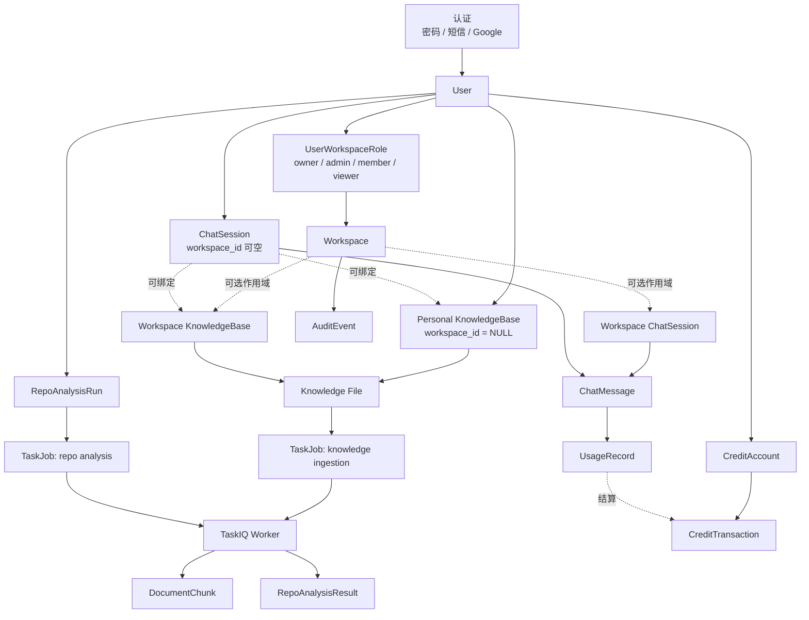
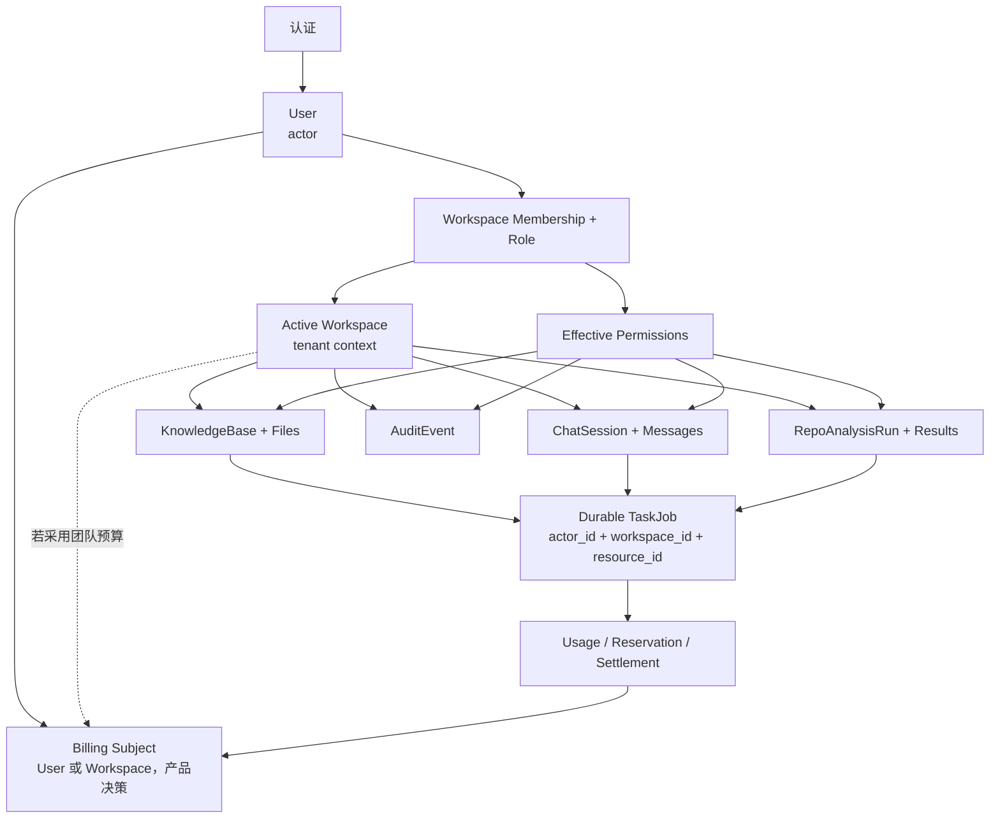

# 产品领域与端到端业务地图评估

> 日期：2026-07-17
> 范围：认证、用户、Workspace、权限、聊天、知识库、仓库分析、积分，以及相关前端入口、异步任务与审计能力
> 性质：基于当前代码的产品领域与端到端业务评估；记录现状、断点和推荐收敛方向，不代表建议已经实施
> 证据基线：分支 `chore/deps-batch-patch`、提交 `af4f855`，以及本地工作区中 2026-07-17 的实现
> 状态：评估基线；本轮仅落地静态分析结论，未实施业务代码、迁移或测试改动

## 1. 结论与评估边界

当前系统还不是一套以 Workspace 为业务根的统一产品，而是三条并行纵线：

1. **个人 AI 助手主线**：认证 -> 用户 -> 个人知识库 -> RAG 聊天 -> 积分。它是前端主体验，也是当前闭环最完整的链路。
2. **Workspace 治理主线**：Workspace -> 成员角色 -> RBAC -> 审计。后端基础较完整，但尚未进入前端主流程。
3. **仓库分析主线**：用户 -> 分析任务 -> GitHub / LLM -> 报告。它已形成独立 MVP，但未连接 Workspace、权限、积分和审计。

因此，当前实际业务根是 `User`，不是 `Workspace`。注册会创建个人 Workspace，但默认知识库、普通聊天、积分账户和仓库分析仍主要按 `user_id` 归属；知识库和聊天虽然支持可空的 `workspace_id`，标准用户路径并不会稳定地把资源放入注册时创建的个人 Workspace。

本报告采用以下证据口径：

- **已确认**：当前 ORM、API、service、workflow 或前端路由可以直接支持的结论。
- **推断**：由多处静态证据组合得到、仍需运行态数据或产品决策验证的判断。
- **建议**：目标业务设计，不表示当前实现或已经排期。

本轮没有验证生产数据分布、历史用户补偿情况、真实流量比例或第三方服务运行状态。

## 2. 当前产品形态

| 业务纵线 | 主要入口 | 核心事实源 | 当前判断 |
| --- | --- | --- | --- |
| 个人 AI 助手 | 登录、首页聊天、知识文件、Credits | User、KnowledgeBase、ChatSession、UsageRecord、CreditAccount | 主流程可用，但异步一致性和计费语义仍有治理债务 |
| Workspace 治理 | 后端 Workspace、成员、权限策略、审计 API | Workspace、UserWorkspaceRole、AuditEvent | 后端能力成形，前端没有 Workspace 上下文和管理入口 |
| 仓库分析 | `/repo-check` | RepoAnalysisRun、TaskJob、RepoAnalysisResult | 独立用户级 MVP，跨域连接尚未建立 |

三个纵线共用用户身份和部分异步基础设施，但没有共享一个稳定的租户、授权和计费上下文。也就是说，“谁发起”通常可以回答，“代表哪个 Workspace、使用谁的预算、结果归谁协作”还不能在所有流程中一致回答。

## 3. 当前领域关系与数据地图

### 3.1 当前实现地图



图中实线表示明确的当前归属或持久化关系，虚线表示可选作用域、可选绑定或业务结算关系。关键特征是：

- `User` 通过 `UserWorkspaceRole` 与 Workspace 多对多关联，角色为 owner、admin、member、viewer。
- KnowledgeBase、File、ChatSession 和 AuditEvent 可以关联 Workspace，但其中前三者允许个人作用域。
- CreditAccount、UsageRecord、RepoAnalysisRun 和 TaskJob 的业务访问控制仍以用户为主，没有 Workspace 账本或 Workspace 任务归属。
- Worker 是知识入库、聊天生成和仓库分析共享的执行基础设施，不等于统一业务边界。

### 3.2 八个领域的责任与成熟度

| 领域 | 当前责任 | 实际主归属 | 与 Workspace 的关系 | 当前成熟度 |
| --- | --- | --- | --- | --- |
| 认证 | 密码、短信、Google 登录，签发用户身份 | User | 新用户注册时创建个人 Workspace | 基础闭环完整，开户路径不一致 |
| 用户 | 身份、资料、超级管理员、旧 Token 配额 | User | 通过角色表加入多个 Workspace | 较成熟，但批量导入未完成 Workspace 开户 |
| Workspace | 租户容器、成员和资源作用域 | Workspace | 目标聚合根，当前多数关系可空 | 后端可用，前端产品化缺失 |
| 权限 | owner/admin/member/viewer 的配置化 RBAC | UserWorkspaceRole | 仅在有 Workspace 上下文时生效 | 局部接入，读写语义未完全一致 |
| 聊天 | 会话、消息、SSE、RAG 与模型调用 | User + 可选 Workspace | 可从 Workspace KB 推导 Workspace | 个人主线可用，协作读取链路不完整 |
| 知识库 | 默认库、上传、异步解析、向量分块 | User + 可选 Workspace | 支持 Workspace KB，但没有完整 CRUD 入口 | 个人主线可用，Workspace 产品面不完整 |
| 仓库分析 | README 可信度初筛与报告生成 | User | 当前无 Workspace 关联 | 独立 MVP |
| 积分 | 签到、消费、过期、模型用量记录 | User | 当前无 Workspace 账户或预算 | 聊天部分闭环，仍与旧 Token 配额并存 |

### 3.3 角色与产品表面

| 角色 | 当前可见产品表面 | 主要限制 |
| --- | --- | --- |
| 匿名访问者 | 登录入口及部分页面外壳 | 后端聊天、知识、积分和仓库分析业务 API 仍要求认证 |
| 普通用户 | 个人聊天、默认知识库、Credits、仓库分析 | 看不到当前 Workspace、成员、有效权限或共享资源入口 |
| Workspace 成员 | 可通过后端角色参与 Workspace 资源授权 | 前端没有选择 Workspace 或管理协作资源的主流程 |
| 超级管理员 | 用户管理与配置允许的全局权限绕过 | 与 Workspace RBAC 是两条权限轴，不能替代租户内角色表达 |

## 4. 端到端业务链路

### 4.1 认证与用户开户

```text
密码 / 短信 / Google
  -> 创建或识别 User
  -> 新注册路径创建 personal Workspace
  -> 赋予 UserWorkspaceRole.OWNER
  -> 签发用户身份
  -> /users/me 返回用户与功能信息
```

已确认的正常注册路径会创建个人 Workspace 并授予 owner 角色。与此同时：

- `/users/me` 没有返回用户的 Workspace 列表、当前 Workspace 或有效权限，前端无法据此建立租户上下文。
- CSV 导入直接批量写入用户，没有调用个人 Workspace 开户逻辑。
- 管理后台“创建用户”调用公开注册接口，而不是独立的管理员创建接口；当公开注册关闭时，这一管理操作可能受同一开关约束。
- 历史用户是否全部拥有个人 Workspace 需要通过数据审计确认，不能仅凭当前注册代码推断。

### 4.2 知识库、聊天与积分

```text
User
  -> 懒创建默认 KnowledgeBase(workspace_id = NULL)
  -> 上传对象并创建 File(UPLOADED)
  -> 创建 TaskJob(PENDING) 并投递 TaskIQ
  -> Worker: PARSING -> CHUNKING -> READY
  -> DocumentChunk 可用于 RAG

User query
  -> Credits / Token 可用性预检
  -> 创建或继续 ChatSession
  -> 写入用户消息和助手占位消息
  -> Worker 执行 RAG / LLM
  -> 回写消息、UsageRecord 与 CreditTransaction
  -> SSE 或非流式响应返回前端
```

这是当前最接近完整闭环的业务链。Workspace KB 可以把 Workspace 作用域带入新会话，但默认 KB 保持个人作用域；不选择 KB 的普通新会话也没有稳定的 Workspace 输入，因此个人聊天仍是默认行为。

### 4.3 Workspace 协作

```text
Workspace CRUD
  -> 成员列表与增删改
  -> owner / admin / member / viewer
  -> PermissionService 判定
  -> Workspace KB / Chat / Audit 的局部授权
```

后端已提供 Workspace CRUD、成员管理、软删除、配置化 RBAC 和审计查询基础，但产品闭环尚未形成：

- 前端路由与 API 模块没有 Workspace、成员或权限管理入口，也没有 active workspace 状态。
- Chat 请求体不接收 `workspace_id`；Workspace 主要通过所选 KB 间接进入会话。
- Knowledge API 只暴露默认 KB、文件上传、文件状态和删除，没有面向用户的知识库创建与列表 API。
- TaskJob 的读取访问按 `user_id` 校验，不能独立表达 Workspace 任务的协作可见性。

### 4.4 仓库分析

```text
User 提交 GitHub URL
  -> RepoAnalysisRun + TaskJob
  -> Worker 获取 GitHub 证据
  -> LLM 或 fallback analyzer
  -> RepoAnalysisResult
  -> 前端轮询单个 run
```

该链路只按提交用户授权，当前没有 Workspace 绑定、Workspace 权限、Credits 结算或审计事件。服务端也没有历史列表端点，前端“最近分析”保存在浏览器 `localStorage`，因此换浏览器、清理站点数据或团队协作时不能作为共享历史。

## 5. 已确认的跨域断点

### 5.1 个人作用域与 Workspace 作用域并存

注册创建了“个人 Workspace”，但默认知识库仍使用 `workspace_id = NULL`，普通聊天也可以保持 `workspace_id = NULL`。这使“个人资源”同时存在两种表达：

1. 直接归属于 User 的 personal scope；
2. 归属于只有该用户的 personal Workspace。

这一双重租户模型会扩散到查询条件、权限判断、对象存储路径、审计、任务可见性和未来计费。它是当前最需要先做产品决策的问题。

### 5.2 权限定义与实际行为没有完全对齐

- `CHAT_READ` 已在枚举和权限配置中定义，但当前后端业务代码没有使用它。
- 继续已有会话时，非 owner 可凭 Workspace 的 `CHAT_WRITE` 通过；会话列表和详情查询仍调用 owner-only 的用户查询服务，因此可能出现“知道 ID 可以继续、列表中却看不到”的不对称。
- 文件删除审计动作是 delete，但 `KnowledgeService.remove_file()` 实际要求 `FILE_WRITE`，没有使用已定义的 `FILE_DELETE`。按当前角色表，member 拥有 write 而没有 delete。
- `/permissions/policy` 返回的是全局策略元数据，不是当前用户在某个 Workspace 的 effective permissions。

这不是 RBAC 缺失，而是 RBAC 只在部分命令路径落地，查询、删除和前端能力发现尚未形成同一契约。

### 5.3 Workspace 后端存在，Workspace 产品不存在

Workspace 目前更像后端治理基础，而不是用户可以进入的产品上下文。缺少 active workspace、共享资源导航、成员管理页面、有效权限读取、Workspace KB CRUD 和共享聊天读取链路后，即使数据库已经支持 `workspace_id`，最终用户也无法稳定完成一条 Workspace 内的端到端任务。

### 5.4 Credits 与旧 Token 配额形成双账本

`CreditAccount.balance` 与 `User.max_tokens / used_tokens` 同时存在。模型消费逻辑优先扣 Credits，不足部分再消耗旧 Token 配额；聊天页面又同时展示两组余额。当前结果是：

- 用户难以理解哪一个余额决定能否调用模型；
- 运营和客服需要解释两套单位与到期规则；
- 账务主体仅为用户，不能表达 Workspace 预算；
- 仓库分析的 LLM 与知识入库的 embedding 没有进入同一 Credits 计量闭环。

### 5.5 异步链路的业务终态尚未统一

聊天链路跨越数据库消息、Redis 幂等、TaskIQ、Credits 和 SSE；知识入库跨越 PostgreSQL、Redis 与对象存储。当前可运行，但在重复投递、进程退出和部分提交时仍存在状态分裂风险。详细证据和实施建议见：

- [Chat / RAG / Worker 主链路治理实施计划](2026-07-15-chat-rag-worker-reliability-plan.md)
- [知识入库、存储与数据一致性改造计划](2026-07-15-knowledge-ingestion-data-consistency-plan.md)

上述两份文档均是计划基线，不应被解读为相关治理已经完成。

### 5.6 用户开户路径不一致

标准注册、第三方首次登录、批量导入和管理员创建用户需要共享一个明确的 provisioning invariant。当前至少可以确认 CSV 导入没有创建个人 Workspace，管理后台创建又复用了公开注册入口；若选择 Workspace-first，必须对历史和所有入口统一补偿。

### 5.7 风险优先级

| 优先级 | 断点 | 主要影响 |
| --- | --- | --- |
| P0 | 租户与计费主体未决 | 后续迁移、权限、账务和 API 设计可能反复 |
| P0 | Chat / knowledge 异步终态不统一 | 重复执行、状态分裂、重复或遗漏计费 |
| P1 | Workspace 前端与共享查询缺失 | 已有 RBAC 无法形成用户价值闭环 |
| P1 | 权限读写语义不一致 | 协作成员看到的能力与实际操作不一致 |
| P1 | 开户路径不一致 | 用户资源基线和历史数据不可证明 |
| P2 | Repo analysis 独立于治理与计费 | 无法形成团队资产、共享历史和统一成本 |

## 6. 推荐的目标业务地图

如果产品目标包含团队协作，建议采用 **Workspace-first**：User 表达操作者，Workspace 表达租户和资源归属，角色表达授权，计费主体则由产品明确选择 User 或 Workspace。个人场景也使用一个 personal Workspace，避免长期维护 `workspace_id = NULL` 与 personal Workspace 两套语义。



目标模型需要坚持五条不变量：

1. `actor_user_id` 回答“谁操作”，`workspace_id` 回答“代表哪个租户”，两者不互相替代。
2. 所有可协作资源有明确 Workspace 归属；个人资源通过 personal Workspace 表达。
3. 命令和查询使用同一套 effective permission 契约，不能只保护写路径。
4. 每次模型、embedding 或外部工具调用都声明计量政策和 billing subject，即使政策是免费或豁免。
5. 异步任务携带稳定的 actor、workspace、resource、idempotency 和 billing 上下文，并可从持久化状态恢复。

如果短期产品明确只做个人 AI 助手，则应做相反但同样清晰的决策：把 Workspace 标记为未来或内部治理能力，暂不对外承诺协作，并避免继续增加半接入的 Workspace 字段和页面。当前列出的产品领域更接近团队协作目标，因此本报告推荐 Workspace-first。

## 7. 分阶段收敛建议

### 阶段 0：先冻结产品不变量

- 决定 personal scope 是否全部收敛为 personal Workspace。
- 决定 Credits 的长期主体是用户、Workspace，还是明确区分个人余额与团队预算。
- 盘点历史用户、空 `workspace_id` 资源、孤立角色、TaskJob 和 UsageRecord，形成迁移基数。
- 定义 Workspace 删除、成员移除、资源转移与账务归档规则。

在这些决策完成前，不宜先做大规模非空约束或历史数据回填。

### 阶段 1：稳定现有高频主链路

- 先执行 Chat / RAG / Worker 的 generation request、幂等、终态和 Credits 一致性治理。
- 先执行知识入库的 outbox、恢复、删除 tombstone 和索引血缘治理。
- 在两条目标设计中预留稳定的 `workspace_id`、`actor_user_id` 和 billing scope，避免可靠性改造完成后再次改协议。

### 阶段 2：完成一条 Workspace 端到端纵线

推荐用“Workspace 知识库 -> 共享聊天”作为首条协作纵线，最小闭环包括：

1. 前端 active workspace 选择与持久化；
2. Workspace 列表、详情、成员和角色管理；
3. 当前用户 effective permissions API；
4. Workspace 知识库创建、列表、上传和文件管理；
5. Workspace 聊天创建、列表、详情和继续会话；
6. 相关写操作与拒绝事件的审计查询。

### 阶段 3：统一授权与开户

- 对齐 `CHAT_READ / CHAT_WRITE` 与 `FILE_READ / FILE_WRITE / FILE_DELETE` 的命令和查询检查。
- 让前端按 effective permissions 展示能力，但后端始终保留最终授权。
- 把密码、短信、Google、管理员创建和 CSV 导入统一到同一 provisioning service。
- 回填并验证历史用户的 personal Workspace 和 owner membership。

### 阶段 4：统一计量并接入仓库分析

- 退出旧 Token 配额，或将它正式定义为与 Credits 不同的产品额度，不再隐式混用。
- 对 chat LLM、repo analysis LLM、embedding 和外部工具建立统一的免费、预留、结算、退款策略。
- RepoAnalysisRun 增加 Workspace 归属、服务端历史列表、权限、审计和计费政策。
- 团队预算场景下，明确并发消费、成员限额和管理员调整的账务规则。

推荐依赖顺序为：

```text
产品不变量
  -> Chat / knowledge 可靠性
  -> Workspace 协作纵线
  -> 授权与开户统一
  -> 计量统一与 repo analysis 接入
```

## 8. 目标完成定义

只有同时满足以下条件，才可以把产品描述为“Workspace 中心的统一业务系统”：

- 每个可登录用户至少有一个可证明的 Workspace membership，且所有开户入口行为一致。
- 个人资源只有一种租户表达，不再依赖调用方猜测 NULL 是个人还是缺失数据。
- 普通成员可以从前端进入 Workspace，按角色完成共享 KB 到共享聊天的完整流程。
- owner、admin、member、viewer 的读、写、删除、成员管理和审计矩阵有后端测试与前端验收。
- Chat、knowledge 和 repo analysis 的任务都能关联 actor、Workspace、业务资源和持久终态。
- 每类付费能力都有可解释、可幂等、可对账的计量政策，UI 只展示产品真实使用的余额语义。
- 成员移除、角色降级、Workspace 删除、Worker 重试和浏览器断连都有明确恢复与审计结果。

## 9. 代码证据索引

### 9.1 领域模型

- Workspace、成员角色与审计：[`backend/models/orm/access.py`](../../backend/models/orm/access.py)
- 用户与旧 Token 配额：[`backend/models/orm/user.py`](../../backend/models/orm/user.py)
- 知识库与文件作用域：[`backend/models/orm/knowledge.py`](../../backend/models/orm/knowledge.py)
- Chat 会话与消息：[`backend/models/orm/chat.py`](../../backend/models/orm/chat.py)
- Credits、流水与用量：[`backend/models/orm/credits.py`](../../backend/models/orm/credits.py)
- 仓库分析与通用任务：[`backend/models/orm/repo_analysis.py`](../../backend/models/orm/repo_analysis.py)、[`backend/models/orm/task.py`](../../backend/models/orm/task.py)

### 9.2 API 与业务服务

- 注册与个人 Workspace：[`backend/services/user_service.py`](../../backend/services/user_service.py)
- CSV 用户导入：[`backend/services/user_import_service.py`](../../backend/services/user_import_service.py)
- Workspace 与成员 API：[`backend/api/v1/endpoint/workspace_api.py`](../../backend/api/v1/endpoint/workspace_api.py)
- 权限配置与策略 API：[`configs/access/permissions.yaml`](../../configs/access/permissions.yaml)、[`backend/api/v1/endpoint/permission_api.py`](../../backend/api/v1/endpoint/permission_api.py)
- Chat 命令与查询授权：[`backend/services/chat_service.py`](../../backend/services/chat_service.py)、[`backend/services/session_query_service.py`](../../backend/services/session_query_service.py)
- Knowledge API 与访问控制：[`backend/api/v1/endpoint/knowledge_api.py`](../../backend/api/v1/endpoint/knowledge_api.py)、[`backend/services/knowledge_service.py`](../../backend/services/knowledge_service.py)
- Credits 双额度消费：[`backend/services/credit_service.py`](../../backend/services/credit_service.py)
- 仓库分析 API 与服务：[`backend/api/v1/endpoint/repo_analysis_api.py`](../../backend/api/v1/endpoint/repo_analysis_api.py)、[`backend/services/repo_analysis_service.py`](../../backend/services/repo_analysis_service.py)

### 9.3 前端产品表面

- 当前路由范围：[`frontend/apps/admin/src/App.tsx`](../../frontend/apps/admin/src/App.tsx)
- 管理员创建用户入口：[`frontend/apps/admin/src/api/users.ts`](../../frontend/apps/admin/src/api/users.ts)
- 仓库分析本地最近记录：[`frontend/apps/admin/src/features/repo-check/recent-runs.ts`](../../frontend/apps/admin/src/features/repo-check/recent-runs.ts)
- Credits 与旧 Token 同屏：[`frontend/apps/admin/src/pages/Chat/index.tsx`](../../frontend/apps/admin/src/pages/Chat/index.tsx)

## 10. 结语

当前项目不是缺少领域能力，而是领域能力的“业务根”没有统一：个人 AI 主线以 User 为根，Workspace 治理以 Workspace 为根，仓库分析又保持用户级独立。下一步的关键不是继续增加孤立页面或字段，而是先冻结租户、授权和计费不变量，再沿一条真实的 Workspace 协作纵线把已有能力连接起来。
