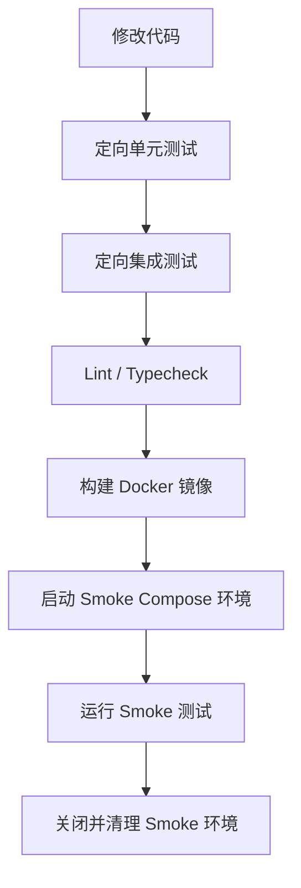

# 开发测试固定流程

本文档用于固定本项目从“修改代码”到“Smoke 验证”的标准执行顺序，作为本地开发、后续 `Makefile` 封装和 CI 流水线的共同依据。

配套的工程化分层标准见：

- [automation-standard.md](/home/tongying/workspace/mlops-project/docs/automation-standard.md)

## 1. 目标

当前阶段的目标不是一次性搭建完整的大型测试平台，而是先把下面这条链路稳定下来：

1. 修改代码
2. 运行定向单元测试
3. 运行定向集成测试
4. 运行静态检查
5. 构建 Docker 镜像
6. 启动 Smoke 测试环境
7. 运行 Smoke 测试
8. 清理 Smoke 环境

这条流程适用于日常开发回归、提交前自检，以及后续接入 CI。

## 2. 流程总览



## 3. 固定执行顺序

### 步骤 1：修改代码

开发者先完成本次需求或修复的代码修改。

要求：

- 优先做小步修改。
- 每一轮修改后尽快跑定向测试，不要攒到最后一起验证。
- Python 相关命令统一使用 `uv run`。

### 步骤 2：运行定向单元测试

目的：

- 先验证当前变更的最小逻辑单元是否正确。
- 这一步应当最快，适合作为开发过程中的高频反馈。

示例：

```bash
make qa-test-unit UNIT_TARGETS=tests/unit/api/test_user_api_unit.py
```

如果改动影响多个模块，则运行对应的单元测试集合，例如：

```bash
make qa-test-unit UNIT_TARGETS="tests/unit/api tests/unit/services tests/unit/repositories"
```

通过标准：

- 单元测试全部通过后，才进入下一步。

### 步骤 3：运行定向集成测试

目的：

- 验证接口层、依赖注入、模块协作是否仍然正确。
- 这一步关注“几个组件能否接起来”，而不是完整部署后的真实环境。

示例：

```bash
make qa-test-integration INTEGRATION_TARGETS="tests/integration/test_user_api.py tests/integration/test_http_infra.py"
```

如果只改动某一条业务链路，则优先运行该链路相关的集成测试；如果影响面较大，再扩大范围。

通过标准：

- 定向集成测试通过后，才进入下一步。

### 步骤 4：运行静态检查

目的：

- 在构建镜像前，先用静态分析拦截明显问题。

命令：

```bash
make qa-lint
make qa-typecheck
```

说明：

- `lint` 用于风格、导入和常见错误检查。
- `typecheck` 用于类型检查。
- 如果本次修改没有通过这一步，不进入镜像构建。

### 步骤 5：构建 Docker 镜像

目的：

- 验证项目在容器环境中可以成功打包。
- 保证后续 Smoke 环境使用的镜像与部署路径一致。

示例：

```bash
make image-build
```

通过标准：

- 镜像成功构建，才进入 Smoke 环境验证。

### 步骤 6：启动 Smoke 测试环境

目的：

- 使用最小但真实的依赖环境，验证关键链路可用性。

当前 Smoke 环境使用：

- [docker-compose.db.yml](/home/tongying/workspace/mlops-project/docker-compose.db.yml)

当前编排包含的核心服务：

- `postgres`
- `redis`
- `db_migrator`
- `api`
- `task_worker`

启动命令：

```bash
make env-smoke-up
make env-smoke-wait
```

说明：

- 该环境用于 Smoke，不追求完整生产拓扑。
- `nginx`、`prometheus`、`grafana`、`vector`、`loki` 暂不作为日常 Smoke 的必需项。

### 步骤 7：运行 Smoke 测试

目的：

- 在真实依赖已启动的情况下，验证系统“活着”且关键路径可用。

建议当前阶段优先覆盖：

1. API 存活检查
2. 数据库就绪检查
3. 一条最关键的业务接口
4. 如果依赖异步任务，再补一条任务链路

示例检查项：

```bash
make verify-smoke
```

后续可逐步把这些检查沉淀为自动化 `pytest` 或脚本，例如：

- 用户登录或用户查询的最小链路
- 聊天最小链路
- 知识库上传后的任务状态链路

通过标准：

- 关键接口返回成功。
- 服务无明显启动异常。
- 若存在任务链路，则任务可被正常消费。

### 步骤 8：关闭并清理 Smoke 环境

目的：

- 防止测试环境长期占用资源。
- 保持每次 Smoke 尽量从干净环境开始。

命令：

```bash
make env-smoke-down
```

如果需要连同数据卷一起清理，可按需手动执行：

```bash
SMOKE_DOWN_VOLUMES=true make env-smoke-down
```

说明：

- 日常开发默认使用 `down`。
- 只有在需要彻底重建测试数据时，才使用 `down -v`。

## 4. 失败处理原则

这条流程遵循“前一步失败，后一步不继续”的原则。

具体要求：

- 单元测试失败：先修复代码，不进入集成测试。
- 集成测试失败：先修复接口协作问题，不进入镜像构建。
- 静态检查失败：先修复代码质量问题，不进入镜像构建。
- 镜像构建失败：先修复打包问题，不启动 Smoke 环境。
- Smoke 失败：先排查容器日志、服务健康状态和依赖服务状态。

推荐排查命令：

```bash
make env-smoke-logs
docker compose -f docker-compose.db.yml ps
```

## 5. 日常执行建议

### 开发中高频循环

适用于正在写某个接口或修一个局部问题时：

```bash
make qa-test-unit UNIT_TARGETS=tests/unit/api
make qa-test-integration INTEGRATION_TARGETS=tests/integration/test_user_api.py
```

### 提交前检查

适用于准备提交代码前：

```bash
make flow-dev-check
```

### 较大改动验证

适用于改动范围较大、影响多个模块时：

```bash
make qa-test-all
make qa-lint
make qa-typecheck
make image-build
make env-smoke-up
make env-smoke-wait
make verify-smoke
make env-smoke-down
```

## 6. 后续自动化落地方向

当前推荐的落地顺序如下：

1. 先以本文档固定流程，统一团队执行顺序。
2. 使用 `Makefile` 暴露统一入口。
3. 使用 `scripts/*.sh` 承载复杂编排。
4. 最后在 CI 中直接复用同一套 `make` 或脚本入口。

推荐原则：

- `Makefile` 负责提供统一入口。
- Shell 脚本负责复杂编排。
- CI 不要重复手写一套新的流程逻辑，应尽量复用本地命令。

## 7. 当前结论

本项目当前阶段，优先级应当是：

1. 固定“代码修改 -> 单元测试 -> 集成测试 -> 静态检查 -> 镜像构建 -> Smoke 验证”这条主链路。
2. 先把最小真实 Smoke 环境跑通。
3. 等这条链路稳定后，再逐步补更完整的 E2E 和 CI/CD。

这份文档是后续 `Makefile`、脚本和 CI 配置的来源说明，不应与自动化实现产生分叉。
