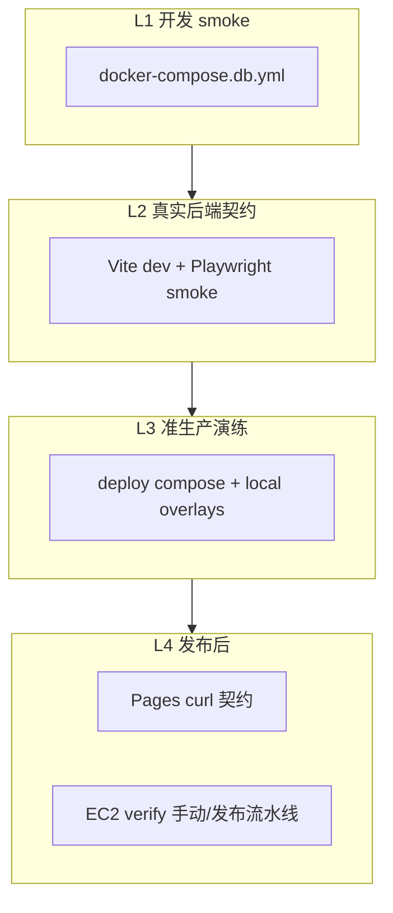

# CI / 本地验证矩阵（设计）

本文档定义 Dewflow **分层验证**的长期目标：本地命令、CI workflow、合并门禁各自验什么，以及分期落地顺序。

配套文档：

- [dev-test-flow.md](dev-test-flow.md) — 本地从改代码到 smoke 的执行顺序
- [automation-standard.md](../standards/automation-standard.md) — Makefile / scripts / CI 约定
- [deploy-ec2.md](../platform/deploy-ec2.md) — 生产部署与 branch protection 前提
- [frontend-cicd-assessment-2026-06-14.md](../assessments/frontend-cicd-assessment-2026-06-14.md) — 前端 CI/CD 评估与缺口来源

**状态**：设计已认可（2026-06-14）；workflow / branch protection 按下文分期实施，本文不代表现网已全部生效。

---

## 1. 设计原则

1. **分层验证**：开发 smoke、真实后端契约、准生产 compose、真生产发布后检查——职责分开，不混成一条巨无霸 pipeline。
2. **本地一站式、CI 分门禁**：开发者继续用 `make flow-local` 等聚合命令；CI 按层拆 job，合并门禁只对「高频、稳定、高性价比」层做 required。
3. **刻意接受环境差**：CI 的 LLM 用 mock、本地 smoke 可用 bifrost；验证的是**契约与拓扑**，不是「CI 与笔记本逐字节一致」。
4. **不重造轮子**：优先复用现有 `Makefile` 目标与 `scripts/`，新 workflow 只编排，不复制业务逻辑。

---

## 2. 四层环境

| 层级 | 名称 | 本地入口 | 验证的核心问题 |
|------|------|----------|----------------|
| **L1** | 开发 smoke | `make env-smoke-*`、`make verify-smoke` | 镜像能 build、compose 能起、后端 HTTP smoke 通 |
| **L2** | 真实后端契约 | `make frontend-e2e-smoke` | 登录 / 聊天 / 积分等前后端契约（Playwright + 真 API） |
| **L3** | 准生产演练 | `make deploy-local-prod-*` | 生产 compose 形态（S3 overlay、logging、frontend-fallback、secret 挂载） |
| **L4** | 真生产 / 发布后 | `make verify-pages`、`make deploy-ec2-verify` | 边缘 CORS/CSP、部署栈远端 smoke（重操作可人工） |



---

## 3. 本地命令 ↔ CI 等价表

本地 **`make flow-local`** 是开发者的一站式聚合；CI **刻意拆分**为多个 workflow，不要求一条 job 复刻全流程。

| 本地步骤 | Makefile / 脚本 | CI 归属（workflow） | 终态：是否 required on `main` |
|----------|-----------------|---------------------|--------------------------------|
| 静态 + 单测 + 前端 build/bundle | `make flow-fast` / `make frontend-check` | `static-ci.yml` → Backend static / Frontend static | **是** |
| **开 PR 前本地预演（static + PR gate）** | `make flow-pr-preflight` | `static-ci.yml` + `pr-gate-ci.yml` | — |
| 后端 integration（CI profile） | `make flow-ci` 内 `qa-test-ci` | `pr-gate-ci.yml` → PR gate | **是**（PR） |
| 前端 e2e-mock | `make frontend-e2e-mock` | `pr-gate-ci.yml` → PR gate | **是**（PR） |
| 镜像 build + Docker smoke 起栈 | `make image-build` + `env-smoke-up` | `smoke-ci.yml` → Docker smoke | **是**（main；PR 按 path） |
| 后端 HTTP smoke | `make verify-smoke` | `smoke-ci.yml` | 同上 |
| integration pytest（smoke 栈） | `flow-local` 内 `run_with_smoke_env.sh pytest` | **计划并入** `smoke-ci.yml`（P2） | **是**（main，P2 后） |
| seed 用户 | `make seed-dev` | `smoke-ci` / `frontend-e2e-smoke-ci`（已有 seed） | **是** |
| 前端 e2e-smoke | `make frontend-e2e-smoke` | `frontend-e2e-smoke-ci.yml` | **是**（P1 起） |
| 准生产 up/wait/verify | `make deploy-local-prod-*` | **计划** `deploy-local-prod-rehearsal-ci`（P3） | **否**（定时 + 告警） |
| compose 静态校验 | `make deploy-local-prod-check`（部分） | `deploy-validate-ci.yml` | PR path（deploy/**） |
| Pages 发布后契约 | `make verify-pages` | `post-deploy-pages-verify.yml` | 发布后自动（非合并门禁） |

### 本地专用、CI 不复制

| 命令 | 说明 |
|------|------|
| `make flow-local` | 本地聚合；日志落盘见 `scripts/flow/local_check.sh` |
| `make flow-pr-preflight` | 开 PR 前预演 static-ci + pr-gate（无 Docker smoke） |
| `make flow-local-full` | 含 performance / LLM 可选套件 |
| `make deploy-ec2-up` 等 | 真 EC2 操作，留在发布流水线或人工 |

---

## 4. 现有 Workflow 清单

| Workflow 文件 | Job 名（GitHub Checks 显示名） | 触发 | 当前职责 |
|---------------|-------------------------------|------|----------|
| `static-ci.yml` | Backend static / Frontend static | 全 PR + main push | lint、typecheck、单测、build、bundle-check、Pages 形态 build |
| `pr-gate-ci.yml` | PR gate | PR（非 draft） | `qa-test-ci` + `frontend-e2e-mock` |
| `smoke-ci.yml` | Docker smoke | main push；PR path 过滤 | Docker 全栈 + `verify-smoke` |
| `frontend-e2e-smoke-ci.yml` | Frontend e2e smoke (real backend) | PR + main push | uvicorn + worker + Playwright smoke |
| `deploy-validate-ci.yml` | Validate deploy assets | PR path（deploy/**） | compose `config -q`、k8s、nginx |
| `post-deploy-pages-verify.yml` | Verify Pages release | Pages deployment success / dispatch | `make verify-pages` |
| `guard-branch-protection.yml` | Verify main required checks | 每周 cron | 审计 branch protection 是否仍配置 |
| `security-ci.yml` | （多个 job） | push / cron / path | audit、trivy 等 |

---

## 5. 合并门禁（branch protection）终态

Cloudflare Pages **不等待** GitHub CI；合并到 `main` 时的 required checks 是发布前的实际闸门。

### 5.1 推荐 required checks（`main`）

| Check 名 | 来源 | 优先级 |
|----------|------|--------|
| Backend static | static-ci | 已有 |
| Frontend static | static-ci | 已有 |
| PR gate | pr-gate-ci | 已有 |
| Frontend e2e smoke (real backend) | frontend-e2e-smoke-ci | **P1 加入** |
| Docker smoke | smoke-ci | **P1 加入** |

### 5.2 不建议设为 required

| Check | 原因 |
|-------|------|
| Local-prod rehearsal（P3） | 慢、资源重、易 flaky；改 weekly + 失败告警 |
| Security CI 全量 | 已有独立节奏；可按 org 策略单独 required |
| Post-deploy Pages verify | 发生在合并之后，不能挡合并 |

### 5.3 配置与审计同源

以下应维护**同一份** required 清单：

1. GitHub Settings → Branch protection → Required status checks
2. [scripts/ci/required_status_checks.txt](../../scripts/ci/required_status_checks.txt)（`guard-branch-protection` 与 bootstrap 脚本读取）
3. [deploy-ec2.md](../platform/deploy-ec2.md) 部署 gate 章节

一键配置（P0 secrets + 可选 P1 branch protection）：

```bash
bash scripts/ci/bootstrap_github_gate.sh --dry-run   # 预览
bash scripts/ci/bootstrap_github_gate.sh           # 写入 E2E secrets
APPLY_BRANCH_PROTECTION=true bash scripts/ci/bootstrap_github_gate.sh
```

---

## 6. Secrets / Variables 清单

### 6.1 前端 e2e-smoke（L2）

| 名称 | 类型 | 用途 | 推荐值 |
|------|------|------|--------|
| `E2E_SMOKE_USER` | Secret | Playwright 登录用户 | `seed_admin` 或 `seed_member`（须与 `make seed-dev` 一致） |
| `E2E_SMOKE_PASS` | Secret | 登录密码 | `SeedPass123!`（与 `scripts/seed/dev_seed.py` 中 `SEED_PASSWORD` 同步） |

本地默认：`Makefile` 导出 `E2E_SMOKE_USER=seed_admin`、`E2E_SMOKE_PASS=SeedPass123!`。

Fork PR 无法读仓库 secrets → `frontend-e2e-smoke-ci` job 会 skip（by design）。

### 6.2 Branch protection 审计

| 名称 | 类型 | 用途 |
|------|------|------|
| `BRANCH_PROTECTION_READ_TOKEN` | Secret | fine-grained PAT，Administration:Read，供 `guard-branch-protection` |

### 6.3 Pages 发布后验证（L4）

| 名称 | 类型 | 用途 |
|------|------|------|
| `DEPLOY_FRONTEND_BASE_URL` | Variable | Pages 前端 origin |
| `DEPLOY_BASE_URL` | Variable | API origin（split-origin） |

`workflow_dispatch` 也可通过 inputs 临时传入。

### 6.4 本地 / smoke / 准生产 secrets（不进 CI artifact）

| 目录 | 场景 |
|------|------|
| `secrets/smoke/` | `docker-compose.db.yml` smoke |
| `secrets/local-prod/` | `deploy-local-prod-*` |
| `secrets/ec2/` | 真 EC2 部署 |

CI 的 L1/L2 使用内联 test env 或 mock provider，**不**挂载开发者本机 `secrets/smoke` 文件。

---

## 7. 环境与 Provider 差异（刻意接受）

| 维度 | 本地 `flow-local` / smoke | CI L1 `smoke-ci` | CI L2 `frontend-e2e-smoke-ci` |
|------|---------------------------|------------------|--------------------------------|
| 运行时 | Docker compose 全栈 | Docker compose 全栈 | GH services + uvicorn + taskiq |
| LLM | 常為 bifrost（`.env.smoke`） | mock | mock |
| 前端 | Vite dev（e2e） | 不测前端 SPA | Vite dev + Playwright |
| 数据库 | smoke postgres 卷 | 同左 | 临时 postgres service |
| seed | `make seed-dev`（flow-local 脚本） | 计划 P2 加入 | 已有 `make seed-dev` |

---

## 8. 分期路线图

| 阶段 | 内容 | 交付物 | 阻塞发布？ |
|------|------|--------|------------|
| **P0 配置** | 配 `E2E_SMOKE_*`、`DEPLOY_*` Variables、`BRANCH_PROTECTION_READ_TOKEN` | `scripts/ci/bootstrap_github_gate.sh` + Settings 手动 PAT | 间接 |
| **P1 门禁对齐** | branch protection + `required_status_checks.txt` | 已落地仓库侧；GitHub Settings 待执行 bootstrap | **是**（合并） |
| **P2 smoke 加深** | `smoke-ci` 增加 `seed-dev` + `run_with_smoke_env.sh pytest`（与 flow-local 同 marker） | smoke-ci.yml 变更 | **是**（main） |
| **P3 准生产 CI** | 新 workflow：`deploy-local-prod-up` → `wait` → `verify`；触发：deploy path PR + weekly cron | `deploy-local-prod-rehearsal-ci.yml`（名待定） | **否**（告警即可） |
| **P4 可选** | split-origin 线上 Playwright；EC2 verify 接入 release workflow | fixture + 新 workflow | 发布流水线 |

**推荐长期落点**：**P2 + P3 完成即够用**；P4 按生产痛点再做。

---

## 9. P3 准生产 CI 设计要点（预埋）

Workflow 行为草案（实施时再建文件）：

```text
on:
  pull_request:
    paths: [deploy/**, docker-compose.db.yml, Makefile, scripts/deploy/**]
  schedule:
    - cron: "0 6 * * 1"   # 每周一
  workflow_dispatch:

steps（示意）:
  make deploy-local-prod-secrets-prepare   # 或 CI 专用 secrets 生成
  make deploy-local-prod-check
  make deploy-local-prod-up
  make deploy-local-prod-wait
  make deploy-local-prod-verify
  always: make deploy-local-prod-down
```

约束：

- Runner 需 Docker + 足够磁盘；timeout 建议 25–30 min。
- 第一版**不跑** Playwright；只跑现有 `deploy-local-prod-verify`（HTTP / smoke pytest 子集）。
- 失败上传 compose logs（对齐 `env-smoke-logs` 模式）。

---

## 10. 运维 Checklist

### 新仓库 / 新维护者 onboarding

- [ ] 阅读本文 + [dev-test-flow.md](dev-test-flow.md)
- [ ] 本地跑通：`make flow-local`（需 Docker、Playwright chromium、`pnpm exec playwright install`）
- [ ] 确认 GitHub Secrets：`E2E_SMOKE_USER`、`E2E_SMOKE_PASS`
- [ ] 确认 Variables：`DEPLOY_FRONTEND_BASE_URL`、`DEPLOY_BASE_URL`（若已接 Pages 自动验证）
- [ ] 确认 `main` branch protection 含 §5.1 五项（P1 后）

### 修改 seed 密码时

- [ ] 改 `scripts/seed/dev_seed.py` 中 `SEED_PASSWORD`
- [ ] 同步 GitHub Secret `E2E_SMOKE_PASS`
- [ ] 同步文档与本节表格

### 新增 required check 时

- [ ] GitHub branch protection 添加 check 名
- [ ] 更新 `guard-branch-protection.yml` 的 `expected`
- [ ] 更新 [deploy-ec2.md](../platform/deploy-ec2.md) 部署 gate 列表
- [ ] 更新本文 §5.1 表格

---

## 11. 明确不做（避免范围蔓延）

| 项 | 原因 |
|----|------|
| CI 单 job 完整复刻 `flow-local` | 慢、难维护、与分层原则冲突 |
| 每个 PR 跑 `deploy-local-prod` 全栈 | 太重；用 P3 低频即可 |
| CI 与本地统一 bifrost 真 LLM | 配额、密钥、flaky；契约层用 mock 足够 |
| 在 CI 内起完整 EC2 | 成本与权限模型不适合 PR 门禁 |

---

## 12. 变更记录

| 日期 | 说明 |
|------|------|
| 2026-06-14 | P0/P1 仓库侧：`required_status_checks.txt`、`bootstrap_github_gate.sh`、`guard-branch-protection` 读文件 |
